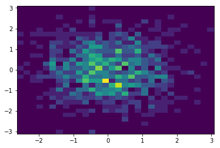
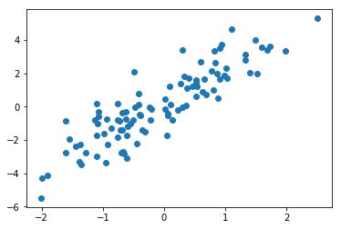
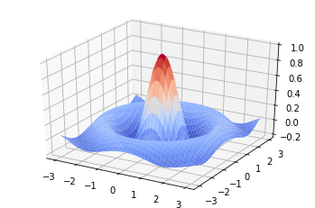
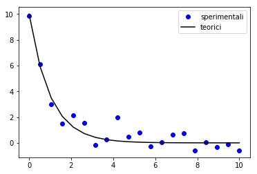

```python
%matplotlib inline
```

# Advanced numerical computations and plotting

## The python scientific ecosystem  - the fundamentals

Python provides several libraries for scientific calculations and visualization

* NumPy : the array data structure and linear algebra
* SciPy : extensive scientific computational library
* Matplotlib : data visualization


### scipy

scipy is a collection of several sub libraries that provide various capabilities:

* Clustering package (**scipy.cluster**)
* Constants (**scipy.constants**)
* Discrete Fourier transforms (**scipy.fftpack**)
* Integration and ODEs (**scipy.integrate**)
* Interpolation (**scipy.interpolate**)
* Input and output (**scipy.io**)
* Linear algebra (**scipy.linalg**)
* Miscellaneous routines (**scipy.misc**)
* $\rightarrow$

* Multi-dimensional image processing (**scipy.ndimage**)
* Orthogonal distance regression (**scipy.odr**)
* Optimization and Root Finding (**scipy.optimize**)
* Signal processing (**scipy.signal**)
* Sparse matrices (**scipy.sparse**)
* linear algebra (**scipy.sparse.linalg**)
* graphs routines (**scipy.sparse.csgraph**)
* Spatial algorithms and data structures (**scipy.spatial**)
* Special functions (**scipy.special**)
* Statistical functions (**scipy.stats**)

## Visualize the data

The first step when exploring data is to visualize them.

There are several libraries to do it, but matplotlib is the most common and is quite simple to use.
Also, most libraries are based on it and knowing it can make your plots even better.


```python
import matplotlib.pylab as plt
import numpy as np
data = np.random.randn(1000) 

fig, ax = plt.subplots()

ax.plot(data)
```


    [<matplotlib.lines.Line2D at 0x7f231d85d2e8>]


    

    


## Are my data really gaussian?

I can use an histogram to check that


```python
data = np.random.randn(1000) 

fig, ax = plt.subplots()

ax.hist(data)
```


    (array([ 10.,  40.,  75., 191., 219., 225., 159.,  63.,  14.,   4.]),
     array([-2.92641215, -2.32024046, -1.71406876, -1.10789707, -0.50172537,
             0.10444632,  0.71061801,  1.31678971,  1.9229614 ,  2.5291331 ,
             3.13530479]),
     <a list of 10 Patch objects>)


    

    


if I have two dimensional data, I can easily visualize the distribution


```python
data = np.random.randn(1000, 2) 

fig, ax = plt.subplots()

ax.hist2d(data[:,0], data[:,1], bins = 30)
```

    


    

    


```python
x = np.random.randn(100) 
y = x*2 + 0.1 + np.random.randn(len(x)) 

fig, ax = plt.subplots()

ax.scatter(x, y)
```


    <matplotlib.collections.PathCollection at 0x7f231d732898>


    

    


## How about 3D?


```python
from mpl_toolkits.mplot3d import Axes3D
from matplotlib import cm
from matplotlib.ticker import LinearLocator, FormatStrFormatter

X, Y = np.mgrid[-3:3:0.05, -3:3:0.05]# creating a bidimensional grid
R = np.sqrt(X**2 + Y**2)
S = np.sinc(R)

fig = plt.figure()
ax = fig.gca(projection='3d')

surf = ax.plot_surface(X, Y, S, cmap=cm.coolwarm)

```


    

    


## multiple figures and costumization

matplotlib provides support for multiple figures and strong costumization of the rendered plot.

In general is worth investing some time to make matplotlib automatically generate the final plot instead of edit it by hand.


```python
x = np.random.randn(1000) 
y = x**2 + 0.1 + np.random.randn(len(x)) 

fig, (ax1, ax2, ax3) = plt.subplots(1, 3, figsize=(12, 4))

ax1.scatter(x, y, marker='^')

ax2.hist(x, alpha=0.5, color='r', density=True, bins=33)

ax3.hist(y, label='transformed data', histtype='step')
ax3.legend()
ax3.set_ylabel("$x^2$ value counts")

fig.tight_layout()
```


    

    


additional plots and configurations, with integration for tabular data visualization, can be found in the library **seaborn** (we will discuss it next week)

## Linear Algebra - LinAlg

Numpy already provides several linear algebra functionality; scipy expands on that

the basic operation for linear algebra is the scalar product between two arrays.
I can obtain it using the `np.dot` function, or the `@` operator


```python
import numpy as np
import scipy as sp

a = np.array([[1,2,3,4,5]])
b = np.array([1,2,3,4,5])
c = np.array([[1,2,3,4,5],[6,7,8,9,10],[11,12,13,14,15]])

print(np.dot(b, b)) # scalar product of b and b
print(sp.dot(b, b))
print(b@b)
```

    55
    55
    55


```python
print('-'*20)
print(np.dot(c, a.T)) # scalar product of c and a transposed
print(np.dot(a, c.T))
print(a@c.T)
```

    --------------------
    [[ 55]
     [130]
     [205]]
    [[ 55 130 205]]
    [[ 55 130 205]]


```python
print('-'*20)
print(np.inner(b, c)) # scalar product of b and c (each line of it)
print(np.inner(c, b))
print(c@b)
```

    --------------------
    [ 55 130 205]
    [ 55 130 205]
    [ 55 130 205]


## Eigenvalues and eigenvectors

To compute the eigenvalues and eigenvectors of a matrix you can use the `np.linalg.eig` function


```python
a = np.eye(4)+np.random.rand(4,4)
eigenvals, eigenvecs = np.linalg.eig(a)

print ("eigenvalues = \n", eigenvals)

print('-'*20)
print(eigenvals[0])
print(eigenvecs[:, 0])

rescaled = (a@eigenvecs[:, 0])/eigenvals[0]
print(rescaled)
```

    eigenvalues = 
     [2.75387545 0.60523752 0.88322277 1.51060656]
    --------------------
    2.753875451917299
    [-0.64094968 -0.5271169  -0.27193994 -0.48721653]
    [-0.64094968 -0.5271169  -0.27193994 -0.48721653]


Often one does not need **all** the eigenvectors or eigenvalues.
Usually one only needs the biggest or the smallest.
There are algorithms that allows to evaluate only those, in particolar useful for sparse matrices

how these eigenvalues are selected is controlled by the `which` parameter:

* 'LM' : largest magnitude (default)
* 'SM' : smallest magnitude
* 'LR' : largest real part
* 'SR' : smallest real part
* 'LI' : largest imaginary part
* 'SI' : smallest imaginary part


```python
eigenval, eigenvec = sp.sparse.linalg.eigs(a, k = 2) # only the first two eigenvalues/vectors
print ("first two eigenvalues = \n", eigenval)

eigenval, eigenvec = sp.sparse.linalg.eigs(a, k = 2, which='SM') # only the first two eigenvalues/vectors
print ("first two eigenvalues = \n", eigenval)
```

    first two eigenvalues = 
     [2.75387545+0.j 1.51060656+0.j]
    first two eigenvalues = 
     [0.60523752+0.j 0.88322277+0.j]


## Symbolic math

while not part of scipy, there is a library worth mentioning for symbolic calculus: **sympy**.

it will allow you to define symbols and manipulate them in a way closer to what one would do while doing math.


```python
import sympy

x = sympy.Symbol('x_1', real=True, nonnegative=True) # declare the symbol `x`
print(x)
```

    x_1


```python
y = 1 + x + x**2 # y is an expression of x
y
```


    x**2 + x + 1


```python
z = y.subs({x : 2}) # replace the value of x inside y
print(z)
z = y.subs({x : sympy.Rational(3, 5)}) # replace the value of x inside y
z
```

    7


    49/25


```python
sympy.limit(y, x, 2, dir='+') # manages limits
```


    7


```python
sympy.solve(y, x, dict=True) # returns all the possible solutions of the equation
```


    [{x: -1/2 - sqrt(3)*I/2}, {x: -1/2 + sqrt(3)*I/2}]


```python
y.diff(x, 1) # derivative of order 1 of y in respect to x
```


    2*x + 1


```python
sympy.integrate(y, (x, 0, 1)) # definite integral
```


    11/6


## Differential equations

Another important topic is the differential equation integration-

There are several ways of solving them, more or less accurate (Euler, RK2, RK4, RK45)

Scipy provides us with a unified interface for this under the **scipy.integrate** module, and the **odeint** function.


```python
from scipy.integrate import odeint
```

let's make a simple example:

$ \dot{y} = -\alpha y $

We know that this equation, given a starting point $y(0) = y_0$, will have as a solution an exponential decay with rate $\alpha$


```python
def derivative(y, t):
    return -y

time = np.linspace(0, 10, 20)
y0 = 10.0
# integration of the differential equation: (function, initial condition, time)
yt = odeint(derivative, y0, time) 

fig, ax = plt.subplots()

ax.scatter(time, yt, marker = 'o', color = 'k', label = 'exponential')
ax.set_xlabel('time', fontsize = 14)
ax.set_ylabel('y(t)', fontsize = 14)
ax.set_title('Exponential ODEint', fontsize = 16)
ax.legend(loc = 'best')

```


    <matplotlib.legend.Legend at 0x7f231b5d2fd0>


    

    


## Fitting of a curve

Let's suppose that we want to fit some noisy data that come from an exponential curve (like the one we evaluated earlier)


```python
y_obs = yt.ravel() + np.random.randn(len(yt))*0.5

fig, ax = plt.subplots()

ax.plot(time, y_obs, 'bo', label = 'sperimentali')
ax.plot(time, yt, 'k-', label = 'teorici')
ax.legend(loc = 'best')

```


    <matplotlib.legend.Legend at 0x7f231b540cf8>


    

    


this fit can be done using the **curve_fit** function from the **scipy.optimize** module.

we need to pass it the complete function that we want to integrate.


```python
from scipy.optimize import curve_fit

def decay_equation(tempo, alfa):
    return 10 * np.exp(-alfa*tempo)
```


```python
# (function, ascissa, time, initial guess for the parameters)

fit_alfa, var_alfa = curve_fit(decay_equation, time, y_obs, p0=[0.9]) 
std_alfa = np.sqrt(var_alfa)
print(fit_alfa, std_alfa)
```

    [0.96065522] [[0.09054491]]


```python
y_hat = decay_equation(time, fit_alfa)


fig, ax = plt.subplots(figsize=(8, 8))

ax.plot(time, yt, color='blue', linewidth=1, label='original curve')
ax.plot(time, y_obs, marker='o', label='experimental data');
ax.plot(time, y_hat, '-r', label='fitted curve');
ax.legend(loc = 'best', numpoints = 2)
```


    <matplotlib.legend.Legend at 0x7f27bec39ac8>


    

    


## Metropolis Algorithm

Algorithm that can be used to estimate the integral of a function using a Monte-Carlo evaluation.
In this case we will use it to estimate the value ot $\pi$.

We can consider a circle of radius 1, centered in the origin.
This circle has an area of $\pi$
Let's imagine a square inscribing it, centered in the origin as well.
This square has a side of 2, with an area of 4.

If we extract numbers on the plane in the interval $x \in [-1, 1] \, y \in [-1, 1]$
the point will be inside the cirle if 

$$x^2 + y^2 < 1$$

and will be considered a hit.

After a huge number of points, we have that the fraction of points inside the circle should be proportional to the ratio of the area of the circle and the area of the square.
the umbers of hits will therefore be:

$$Hit/Tot = \pi/4$$

you can repeat the simulation `N_runs` times to estimate the precision of your estimate of $\pi$

the following is a very long and slow implementation, can you do better using numpy?


```python
import numpy as np
import time

N = 100_000 # number of MC events
N_run = 100 # number of runs
Nhits = 0.0 # number of points accepted
pi = np.zeros(N_run) # values of pi

start_time = time.time() # start clock 
for I in range(N_run):
    Nhits = 0.0
    for i in range(N):
        x = np.random.rand()*2-1
        y = np.random.rand()*2-1
        res = x*x + y*y
        if res < 1:
            Nhits += 1.0
    pi[I] += 4. * Nhits/N

run_time = time.time()

print("pi with ", N, " steps for ", N_run, " runs is ", np.mean(pi), " in ", run_time-start_time, " sec")
print("Precision computation : ", np.abs(np.mean(pi)-np.pi))
```

    pi with  100000  steps for  100  runs is  3.1417231999999995  in  20.12169909477234  sec
    Precision computation :  0.00013054641020637803

