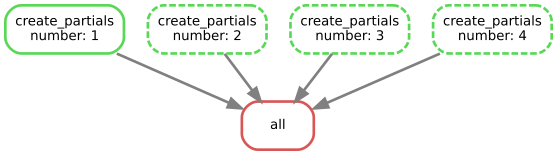

# Data pipeline and Snakemake

Today we discuss how to structure a data analysis pipeline, which is the logic of it, how to manage data and automate the analysis with **worflow management tools**

in particular, the one we are going to use is called **snakemake**

Coming back to the previous lessons about analysis reliability and reproducibility:

> anything you do by hand is to be consider already forgotten.
> you have to automate it as soon as possible

This automation can be done at several levels:

* do not manually change the data
* do not trow away the results of the analysis
* do not check them just with your eyes
* manually join the various steps of the analysis

In an ideal world, all the analysis and preliminary reports should be done with a single push of the button

## Data types

data can be usually distinguished in two main types:

* text data
* binary data

### Text data

These data are nothing more than text files where the data are formatted in a way that makes them understandable by a computer as well as readable by a human being.

These are usually expensive in terms of disk space and read/write time, but are also more robust to data corruption and can be easily inspected and audited by a human being.

These formats are often compressed to save disk space and bandwidth, and should formally be considered binary formats, but given that many libraries are able to read them both compressed and uncompressed, I will pretend that there is no difference

#### text data - csv (and tsv)

Thise formats are used to store tabular data, storing the table line by line, where each line is separated by a comma (**Comma Separated Values**) or tab characters (**Tab Separated Values**).

One might find several variations of this format, for example dividing data using `|` or `;`, and wheter text data contained in a cell si surrounded by `""` or not.

    name;age;residency
    Antonio;32;Bologna
    Maria;25;Torino
    Francesco;47;Napoli
        
Many variants consider the `#` character at the beginning of the line to be a comment.

They can be easily opened with programs wuch as Microsoft Excel or OpenOffice Calc, but they are limited in storing only tabular formats

#### Text data - JSON

A standardized exchange format on the web, it is very useful to represent hierarchical data.
It can roughly be thought as a text equivalent of a dictionary containing numbers, string, lists or other dictionaries.

It is white space insensitive.

    {"people":
        {"antonio": 
            {"age": "32", "residency": "Bologna"},
         "maria": 
            {"age": "20", "residency": "Cesena"},
         }
    }

#### text data - JSON lines

[JSON lines](http://jsonlines.org/) is a recently proposed merge between **csv** and **json**, where each line is a valid json list, but the whole structure represents a tabular dataset.

The advantage is that standard json parsers can be used to manage these files, simplifying the interoperability across systems (which is often a problem with the **csv** format, that does not have a formal specification)

    ["Name", "Session", "Score", "Completed"]
    ["Gilbert", "2013", 24, true]
    ["Alexa", "2013", 29, true]
    ["May", "2012B", 14, false]
    ["Deloise", "2012A", 19, true] 

#### text data - INI

INI were designed under microsoft windows as configuration files, and have become a very common format to include this kind of information (including in python).
They a syntax and expressiveness similar to JSON, but several simplifications

    [Section]
    key_with_value = 2
    boolean_toggle_key
    
        [subsection]
        sub_detail = 3
    
    [New section]
    another_parameter = "hash code"

#### text data - YAML

YAML is another configuration format. 
It's quite rich and easy to write and parse for humans, but it's a format so rich and potentially complicated that there is no actually guarantee that any library can successfully import your data if the format is very complicated.

It's quite comfortable to use if you don't need very complicated data.

    people:
        Antonio:
            age: 30
            residency: Ferrara
            hobby: [fishing, football]
        Maria:
            age: 20
            residency: Torino
            hobby: [snorkling, skydiving]

#### text data - XML

This format is an evolution of the original XML, and is well suited to represent very complicated and interconnected data (could replace an entire database), but it is extremely verbose and parsing it can be non-trivial if there is no specification of its structure.

    <peoplelist>
        <person name='Antonio'>
            <birthyear>1983</birthyear>
            <townofresidency>Bologna</townofresidency>
            <hobbies>
                <fishing/>
                <football/>
            </hobbies>
        </person>
        <person name='Maria'>
            <birthyear>1997</birthyear>
            <townofresidency>Rimini</townofresidency>
            <hobbies>
                <snorkling/>
                <skydiving/>
            </hobbies>
        </person>
    </peoplelist>

#### notes on XML

a lot of "regular" formats are actually XML under the hood:

* svg vector images
* openoffice and office documents (compressed xml)
* many html pages
* several specialistic formats in various fields

### Binary formats

Binary file formats codify the informations directly in a compressed way, exploiting the bit representation of numbers and text and their compression.

Several of these formats are often specifics of a single application, but there are several well known formats that you might find in several fields.

I'm going to list few of them that are common enough to be worth knowing.

#### Binary formats - lossless images (bmp, png, gif, tiff)

These formats contains images stored as individual pixels, each one representing the three fundamental colors (Red, Green and Blue), with different kind of compression, but without losing any kind of information (compared to lossy formats such as jpeg).

If your image is a plot and not a generic image, consider storing it as an svg instead, as it allows modification of the elements of the plot after the generation.
Or, even better, automatize so that you don't need that final edit!

#### Binary formats - DICOM

Medical format for storing medical images (2D or 3D), for things such as mammographies, CAT scans, PET, MRI, etc...

They contain a great amount of metadata about instrument configuration and the patient, and as such should be treated carefully to avoid problems with patient personal data treatment.

#### Binary format - numpy format (NPY)

Numpy defines its own binary format, useful to save single arrays in a very easy and simple (and open) format.

Given the limitations to singles array and no compression, it's not a great format for long term storage, but they can be useful as a temporary file storage during analysis

#### Binary formats - HDF5

This is a generic storage format, appropriate for storing multiple, complex numerical data (typically in some form of tabular structure).

It is the default version of saving data for the recent versions of Matlab (even if they hide it using the .mat file extension).

This file is basically an entire virtual filesystem that can store arbitrarily big data and related metadata.

It is very good for long term storage but not great if one needs to repeatedly modify the existing data.

#### Binary formats - databases (sqlite)

Databases are the traditional solution for long term data storage, where data needs to be queried and modified often. Most databases requires a dedicated machine or a client-server architecture, but sqlite, a very common and open source database, store everything in a single file.

The APIs to interact with it are included in most languages in a way or another. For example python comes with the module **sqlite3** in the standard library.

#### Performances of various formats

Performances of various formats to save a medium sized numerical matrix (500 columns x 150'000 rows)


| format                | file size  | write time|read time| size after compression|
|-----------------------|------------|-----------|---------|-----------------------|
| extended csv          | 430 MB     | 1m 15s    | 9.78s   | 132 MB                |
| csv with gzip         | 132 MB     | 6m 57s    | 16.2s   |                       |
| hdf5 uncompressed     | 463 MB     | 155ms     | 299ms   | 154 MB                |
| npy uncompressed      | 462 MB     | 638ms     | 393ms   | 154 MB                |

### File hashing

A common and useful operation in data analysis is the so called **file hashing**.

This involves generating an alfanumerical string (a mixture of digits and upppercase and lowercase letters) from the content of the file that identify almost perfectly.

Good hashing algoritms guarantee that for small modifications of the file bits, there will be huge variations in the resulting hash, allowing to use these string to guarantee data integrity (but not security).

There are several ways to calculate the hash (SHA1, MD5, SHA512, etc...) so the algorithm used should be explicitely told to allow to replicate the hash.

Virtually all version control systems use hashing to check if data changed or not.


```python
import hashlib

stringa1 = "1 am an innocent string".encode('utf8')
r = hashlib.md5(stringa1).hexdigest()
print('md5: {}'.format(r))

stringa1 = "l am an innocent string".encode('utf8')
r = hashlib.md5(stringa1).hexdigest()
print('md5: {}'.format(r))

stringa1 = "I am an innocent string".encode('utf8')
r = hashlib.md5(stringa1).hexdigest()
print('md5: {}'.format(r))
```

    md5: 24e0f1fe1d8407d2faff6ed758b18270
    md5: bcef484a5550fc09f0eb1acbcc3d9089
    md5: 1d9014f6be7aec56a8d0f4d10404546a


```python
!md5sum ./Lesson_01_introduction.ipynb
```

    2cef471efb258f70189297aa9992e6a4  ./Lesson_01_introduction.ipynb


```python
def md5(fname):
    """hash function appropriate for big data"""
    hash_md5 = hashlib.md5()
    with open(fname, "rb") as f:
        for chunk in iter(lambda: f.read(4096), b""):
            hash_md5.update(chunk)
    return hash_md5.hexdigest()

hash_result = md5("Lesson_01_introduction.ipynb")
print(hash_result)
```

    2cef471efb258f70189297aa9992e6a4


## Data Pipelines

Now that we have an idea on how to recognize data, we can discuss on how this data can be connected together on an data analysis pipeline

We can use a simple classification to discuss them.
These are not formal, official name, just useful to discuss them and their role, and they reflect the tipical use in a pipeline

1. metadata
2. raw data
3. source code
4. source data
5. usage data
6. intermediate data
7. temporary data

### 1 - metadata

Data related to the data that are going to be analyzed.

Typically stored as a simple text file, it usually describe why the data have been collected, the experimental procedure, when, who did it, and so on.

It might seem trivial, but after few years one might find themselves with a disk full of TBs of data that they have no idea what to do with because they don't know what data they are.

Data of which one have no idea of the reason of existance if functionally as good as completely deleted data.

Often it also include the hash values of raw data and source code to make sure of their integrity.

### 2 - raw data

These are the original data that came out of your experiments.
Directly from the machine, with no human intervention, **AT ALL**.
One will not use these in the analysis, but will process to make them suitable for analsys.
They might be in the most weird formats, and if they need some specific program to be read, it would be a good idea to keep track of that as well (if possible, store the program as well).

These data **ARE SACRED**

They should be preserved and never changed.

If one happens to get new versions (for example a measure has been repeated and updated), do not overwrite them, but store them alongside the previous version.

Dal punto di vista di FOSSIL per il controllo di versione, questo tipo di dati può essere tenuto nel repository come **unversioned**, visto che non dovrebbe essere modificato.

### 3 - source code

It might seems trivial, but the source code to process and analyze the data contains informations about the data that might not be available elsewhere:

* how should the data be read and processed
* how were the errors corrected?
* what are possible things to be aware of when using them?
* which analysis have already been done?

This are information about the data and should be treated as such, and are often as important as the RAW data.

This is another reason to use the version control!

### 4 - source data

Once one has the RAW data, they can be processed in a useful format using the script generated by the source code.
This format is the one that you will load with other program to preprocess them in the format used for the analysis.

Using this script one can:
* merge files broken down in various way (for example data divided by subjects), adding info about the origin
* correct mistakes in the RAW files (don't edit them!)
* restructure them in a data structure easy to maintain in the long term (my preference goes for text files such as csv)

In this phase you should try to maintain the value of the data as close to the RAW as possible (but not necessarely their structure), so avoid any kind of preprocessing, such as detrending, normalizations and so on.

If the RAW are already in a reasonable format, you could consider them also as your source data, but I never seen it happens.
Most of the time, when this happens, those data are not really raw data, but preprocessed ones...try to understand what have been done to them!

### 5 - usage data

This is the actual starting point of our analysis.

Starting from the **source data**, we can compose them in a format more comfortable for the analysis that we want, without worrying about database normalization, information duplication and so on.

These data are typically going to be generated only once for each analysis, unless one finds problems with the underlying concept of the analysis (so one needs a different format) or in the assumptions of the data (so one might needs to go and reprocess the RAW data into the source data)

different analysis might need different **usage data**

### 6 - intermediate data

Your analysis will probably be composed of several steps, such as data split, normalization, detrending and so on.


After each one of these steps, is it good practice to keep track of the results with an intermediate dataset, so that you can recover your analysis at any point without having to run everything that led to that result.

Usually the only issue that one might have losing this data is having to re-run the analysis, requiring more time

### 7 - temporary data

these are the intermediate results of analysis steps, similarly to the **intermediate data**, but with the explicit goal of being deleted after the end of each step.

These might be generated for example by a parallel distributed algorithm, that analyze one patient at the time and then merge the results at the end of the run.
Once the final table has been generated, there is no reason to keep the other files around consuming space, and thus they need to be removed.

# Snakemake

**Snakemake** is a python reimplementation of the ideas behind the classing GNU make, traditionally used for code compilation.

Snakemake allows to automatize complicated data processing pipelines in a very comfortable fashion, then to scale them up to parallel processing and distributed computing (included grids) with few lines of code.

It allows to connect simple bash (or powershell) scripts, python and R programs and to mix raw python code in the pipeline code.

Snakemake is only one of several system for worklow management.

Is the one that in my personal opinion is closer to our needs, but I suggest you to check also the others if you need to.

Sone famous other libraries (not all targeted to python) are:

* Luigi
* Apache Airflow
* BigDataScript
* Dask
* Nextflow

A more comprehensive list can be found at: [awesome-pipeline](https://github.com/pditommaso/awesome-pipeline)

The fundamental element of snakemake is the **rule**, that represent a program (typically a script), and the program input and output files.

Each rule get executed as a separated process, orchestrated by the main snakemake execution.

Each rule can have several subsections, of which the most important are:

* **output**: the list of files that the list will generate (is a promise, you will actually have to create them inside the rule)
* **input**: the list of files required by the rule to be executed to generate the promised output files
* **run** or **shell**: execute one or more shell (or python) commands

By default, if nothing else is specified, snakemake tries to execute the rule **all**


If the output files of a rule exists already, the rule is skipped (unless you force snakemake to).

If the input required to generate those output do not exists, snakmake tries to find another rule that can have those input file as output of its executions.

This structure is called **pull** (I specify my arrive point, and try to guess how to get there), compared to the **push** model, in which one specifies explicitely how the data flows from one step to the other.

Working with a **pull** approach takes some time to get used to, but can provide several advantages for heavy computations.


```python
!cd ~/didattica/corso_programmazione_1819/programmingCourseDIFA
!mkdir -p snakemake_lesson
!cd snakemake_lesson

!rm *.txt

%cd ~/didattica/corso_programmazione_1819/programmingCourseDIFA
%cd snakemake_lesson

!pwd
```

    /home/enrico/didattica/corso_programmazione_1819/programmingCourseDIFA
    /home/enrico/didattica/corso_programmazione_1819/programmingCourseDIFA/snakemake_lesson
    /home/enrico/didattica/corso_programmazione_1819/programmingCourseDIFA/snakemake_lesson


```python
%%file Snakefile

rule all:
    shell:
        "echo 'hello world' > result.txt"
```

    Writing Snakefile


```python
!snakemake
```

    Building DAG of jobs...
    Using shell: /bin/bash
    Provided cores: 1
    Rules claiming more threads will be scaled down.
    Job counts:
    	count	jobs
    	1	all
    	1
    
    [Mon Mar 18 13:28:35 2019]
    rule all:
        jobid: 0
    
    [Mon Mar 18 13:28:35 2019]
    Finished job 0.
    1 of 1 steps (100%) done
    Complete log: /home/enrico/didattica/corso_programmazione_1819/programmingCourseDIFA/snakemake_lesson/.snakemake/log/2019-03-18T132835.224533.snakemake.log


```python
!ls
```

    result.txt  Snakefile


If the output of a rule already exists, and is more recent than the input file, the rule will not be executed.

This property is called **idempotency**, and makes the execution of the script easier to predict.

It is still possible to force snakemake's hand if one needs to (study in the manual how)


```python
%%file Snakefile

rule all:
    output:
        "result.txt"
    shell:
        "echo 'hello world' > {output}"
```

    Overwriting Snakefile


```python
!snakemake
```

    Building DAG of jobs...
    Nothing to be done.
    Complete log: /home/enrico/didattica/corso_programmazione_1819/programmingCourseDIFA/snakemake_lesson/.snakemake/log/2019-03-18T132839.150574.snakemake.log


```python
!rm result.txt
```


```python
!snakemake
```

    Building DAG of jobs...
    Using shell: /bin/bash
    Provided cores: 1
    Rules claiming more threads will be scaled down.
    Job counts:
    	count	jobs
    	1	all
    	1
    
    [Mon Mar 18 13:28:40 2019]
    rule all:
        output: result.txt
        jobid: 0
    
    [Mon Mar 18 13:28:40 2019]
    Finished job 0.
    1 of 1 steps (100%) done
    Complete log: /home/enrico/didattica/corso_programmazione_1819/programmingCourseDIFA/snakemake_lesson/.snakemake/log/2019-03-18T132840.589923.snakemake.log


if the required input files:
    
* do not exists
* there is no rule that can generate them

snakemake will crash with an error


```python
%%file Snakefile

rule all:
    input:
        "partial_1.txt",
        "partial_2.txt"
    output:
        "result.txt"
    shell:
        "cat {input} > {output}"
```

    Overwriting Snakefile


```python
!snakemake
```

    Building DAG of jobs...
    MissingInputException in line 2 of /home/enrico/didattica/corso_programmazione_1819/programmingCourseDIFA/snakemake_lesson/Snakefile:
    Missing input files for rule all:
    partial_2.txt
    partial_1.txt


Let's see how would a script look using two rules, one to generate the partial files and one to process them


```python
%%file Snakefile

rule all:
    input:
        "partial_1.txt",
        "partial_2.txt"
    output:
        "result.txt"
    shell:
        "cat {input} > {output}"
        
rule create_partials:
    output:
        "partial_1.txt",
        "partial_2.txt"
    run:
        for filename in output:
            with open(filename, 'w') as file:
                print("the result of {}".format(filename), file=file)
```

    Overwriting Snakefile


```python
!rm result.txt
```


```python
!snakemake
```

    Building DAG of jobs...
    Using shell: /bin/bash
    Provided cores: 1
    Rules claiming more threads will be scaled down.
    Job counts:
    	count	jobs
    	1	all
    	1	create_partials
    	2
    
    [Mon Mar 18 13:28:47 2019]
    rule create_partials:
        output: partial_1.txt, partial_2.txt
        jobid: 1
    
    Job counts:
    	count	jobs
    	1	create_partials
    	1
    [Mon Mar 18 13:28:47 2019]
    Finished job 1.
    1 of 2 steps (50%) done
    
    [Mon Mar 18 13:28:47 2019]
    rule all:
        input: partial_1.txt, partial_2.txt
        output: result.txt
        jobid: 0
    
    [Mon Mar 18 13:28:47 2019]
    Finished job 0.
    2 of 2 steps (100%) done
    Complete log: /home/enrico/didattica/corso_programmazione_1819/programmingCourseDIFA/snakemake_lesson/.snakemake/log/2019-03-18T132847.277140.snakemake.log


```python
!ls
```

    partial_1.txt  partial_2.txt  result.txt  Snakefile


```python
!cat partial_1.txt
```

    the result of partial_1.txt


```python
!cat partial_2.txt
```

    the result of partial_2.txt


```python
!cat result.txt
```

    the result of partial_1.txt
    the result of partial_2.txt


If the intermediate files already exists, the rule will not be executed again


```python
!rm result.txt
```


```python
!snakemake
```

    Building DAG of jobs...
    Using shell: /bin/bash
    Provided cores: 1
    Rules claiming more threads will be scaled down.
    Job counts:
    	count	jobs
    	1	all
    	1
    
    [Mon Mar 18 13:28:52 2019]
    rule all:
        input: partial_1.txt, partial_2.txt
        output: result.txt
        jobid: 0
    
    [Mon Mar 18 13:28:52 2019]
    Finished job 0.
    1 of 1 steps (100%) done
    Complete log: /home/enrico/didattica/corso_programmazione_1819/programmingCourseDIFA/snakemake_lesson/.snakemake/log/2019-03-18T132852.354044.snakemake.log


In this script the same python function create both files, one at the time, even if there is no need to wait.

They could be generated concurrently, without waiting.
To be able to do this I have to specify a rule that generate a **generic** partial file, using **wildcards**, and let snakemake do the rest.

Wildcards might cause severe headaches, do not try to get too fancy with them!


```python
!rm *.txt
```


```python
%%file Snakefile

rule all:
    input:
        "partial_1.txt",
        "partial_2.txt",
    output:
        "result.txt"
    shell:
        "cat {input} > {output}"
        
rule create_partials:
    output:
        out="partial_{number}.txt"
    run:
        filename = output.out
        with open(filename, 'w') as file:
            print("the result of {}".format(filename), file=file)
```

    Overwriting Snakefile


```python
!snakemake
```

    Building DAG of jobs...
    Using shell: /bin/bash
    Provided cores: 1
    Rules claiming more threads will be scaled down.
    Job counts:
    	count	jobs
    	1	all
    	2	create_partials
    	3
    
    [Mon Mar 18 15:52:33 2019]
    rule create_partials:
        output: partial_2.txt
        jobid: 2
        wildcards: number=2
    
    Job counts:
    	count	jobs
    	1	create_partials
    	1
    [Mon Mar 18 15:52:34 2019]
    Finished job 2.
    1 of 3 steps (33%) done
    
    [Mon Mar 18 15:52:34 2019]
    rule create_partials:
        output: partial_1.txt
        jobid: 1
        wildcards: number=1
    
    Job counts:
    	count	jobs
    	1	create_partials
    	1
    [Mon Mar 18 15:52:34 2019]
    Finished job 1.
    2 of 3 steps (67%) done
    
    [Mon Mar 18 15:52:34 2019]
    rule all:
        input: partial_1.txt, partial_2.txt
        output: result.txt
        jobid: 0
    
    [Mon Mar 18 15:52:34 2019]
    Finished job 0.
    3 of 3 steps (100%) done
    Complete log: /home/enrico/didattica/corso_programmazione_1819/programmingCourseDIFA/snakemake_lesson/.snakemake/log/2019-03-18T155233.983477.snakemake.log


To be able to use wildcards I need somewhere an **expand** command, that tells snakemake exactly which files to search for.

I can have several wildcards at the same time, the important thing is to give an example that allows to initialize all of them.

There are methods for automatic inference of wildcards, but I suggest to start using the explicit ones


```python
%%file Snakefile

numbers = [1, 2, 3, 4]

rule all:
    input:
        expand("partial_{number}.txt", number=numbers)
    output:
        "result.txt"
    shell:
        "cat {input} > {output}"
        
rule create_partials:
    output:
        out = "partial_{number}.txt"
    run:
        filename = output.out
        with open(filename, 'w') as file:
            print("the result of {}".format(filename), file=file)
```

    Overwriting Snakefile


```python
!rm result.txt 
```


```python
!ls
```

    partial_1.txt  partial_2.txt  Snakefile


```python
!snakemake
```

    Building DAG of jobs...
    Using shell: /bin/bash
    Provided cores: 1
    Rules claiming more threads will be scaled down.
    Job counts:
    	count	jobs
    	1	all
    	2	create_partials
    	3
    
    [Mon Mar 18 13:28:58 2019]
    rule create_partials:
        output: partial_4.txt
        jobid: 4
        wildcards: number=4
    
    Job counts:
    	count	jobs
    	1	create_partials
    	1
    [Mon Mar 18 13:28:59 2019]
    Finished job 4.
    1 of 3 steps (33%) done
    
    [Mon Mar 18 13:28:59 2019]
    rule create_partials:
        output: partial_3.txt
        jobid: 3
        wildcards: number=3
    
    Job counts:
    	count	jobs
    	1	create_partials
    	1
    [Mon Mar 18 13:28:59 2019]
    Finished job 3.
    2 of 3 steps (67%) done
    
    [Mon Mar 18 13:28:59 2019]
    rule all:
        input: partial_1.txt, partial_2.txt, partial_3.txt, partial_4.txt
        output: result.txt
        jobid: 0
    
    [Mon Mar 18 13:28:59 2019]
    Finished job 0.
    3 of 3 steps (100%) done
    Complete log: /home/enrico/didattica/corso_programmazione_1819/programmingCourseDIFA/snakemake_lesson/.snakemake/log/2019-03-18T132858.929586.snakemake.log


```python
!cat result.txt
```

    the result of partial_1.txt
    the result of partial_2.txt
    the result of partial_3.txt
    the result of partial_4.txt


```python
!rm partial_1.txt
!rm result.txt
```

Snakemake allows one to generate a flow chart of the execution plan, that allow to visualize everything that has been done or needs to be done


```python
!snakemake --dag | dot -Tsvg > dag.svg
```

    Building DAG of jobs...


```python
!cp ./dag.svg ../immagini/snakemake_dag.svg
!convert ../immagini/snakemake_dag.svg ../immagini/snakemake_dag.png
```



Another very useful function if the **provenance** registry, that keeps track of which files have been created by which rule, when and with which parameters

This allows to trace the origin of each file in an easy way

It can also the set to append the provenance to the complete log, giving the complete history of all files and how they have been changed over time


```python
!snakemake --detailed-summary > provenance.tsv
```

    Building DAG of jobs...


```python
import pandas as pd
pd.read_csv("provenance.tsv", index_col=0, sep='\t')
```


<div>
<style scoped>
    .dataframe tbody tr th:only-of-type {
        vertical-align: middle;
    }

    .dataframe tbody tr th {
        vertical-align: top;
    }

    .dataframe thead th {
        text-align: right;
    }
</style>
<table border="1" class="dataframe">
  <thead>
    <tr style="text-align: right;">
      <th></th>
      <th>date</th>
      <th>rule</th>
      <th>version</th>
      <th>log-file(s)</th>
      <th>input-file(s)</th>
      <th>shellcmd</th>
      <th>status</th>
      <th>plan</th>
    </tr>
    <tr>
      <th>output_file</th>
      <th></th>
      <th></th>
      <th></th>
      <th></th>
      <th></th>
      <th></th>
      <th></th>
      <th></th>
    </tr>
  </thead>
  <tbody>
    <tr>
      <th>result.txt</th>
      <td>-</td>
      <td>all</td>
      <td>-</td>
      <td>NaN</td>
      <td>partial_1.txt,partial_2.txt,partial_3.txt,part...</td>
      <td>cat partial_1.txt partial_2.txt partial_3.txt ...</td>
      <td>missing</td>
      <td>update pending</td>
    </tr>
    <tr>
      <th>partial_1.txt</th>
      <td>-</td>
      <td>create_partials</td>
      <td>-</td>
      <td>NaN</td>
      <td>NaN</td>
      <td>-</td>
      <td>missing</td>
      <td>update pending</td>
    </tr>
    <tr>
      <th>partial_2.txt</th>
      <td>Mon Mar 18 13:28:47 2019</td>
      <td>create_partials</td>
      <td>-</td>
      <td>NaN</td>
      <td>NaN</td>
      <td>-</td>
      <td>rule implementation changed</td>
      <td>no update</td>
    </tr>
    <tr>
      <th>partial_3.txt</th>
      <td>Mon Mar 18 13:28:59 2019</td>
      <td>create_partials</td>
      <td>-</td>
      <td>NaN</td>
      <td>NaN</td>
      <td>-</td>
      <td>ok</td>
      <td>no update</td>
    </tr>
    <tr>
      <th>partial_4.txt</th>
      <td>Mon Mar 18 13:28:59 2019</td>
      <td>create_partials</td>
      <td>-</td>
      <td>NaN</td>
      <td>NaN</td>
      <td>-</td>
      <td>ok</td>
      <td>no update</td>
    </tr>
  </tbody>
</table>
</div>


```python
!rm *.txt
```

If I want to execute several rules at the same time (obviously maintaining the execution oerder needed for the files to be generated) I just need to add the  `--cores <N>` and snakemake will execute automatically in parallel everything it can given the available number of processors defined

There is an equivalent way to launch the execution on a cluster job queue, making distributed computing really easy.


```python
!snakemake --cores 6
```

    Building DAG of jobs...
    Using shell: /bin/bash
    Provided cores: 6
    Rules claiming more threads will be scaled down.
    Job counts:
    	count	jobs
    	1	all
    	4	create_partials
    	5
    
    [Mon Mar 18 13:29:13 2019]
    rule create_partials:
        output: partial_3.txt
        jobid: 3
        wildcards: number=3
    
    [Mon Mar 18 13:29:13 2019]
    rule create_partials:
        output: partial_4.txt
        jobid: 4
        wildcards: number=4
    
    [Mon Mar 18 13:29:13 2019]
    rule create_partials:
        output: partial_1.txt
        jobid: 1
        wildcards: number=1
    
    [Mon Mar 18 13:29:13 2019]
    rule create_partials:
        output: partial_2.txt
        jobid: 2
        wildcards: number=2
    
    Job counts:
    	count	jobs
    	1	create_partials
    	1
    Job counts:
    	count	jobs
    	1	create_partials
    	1
    [Mon Mar 18 13:29:13 2019]
    Job counts:
    	count	jobs
    	1	create_partials
    	1
    Finished job 4.
    1 of 5 steps (20%) done
    [Mon Mar 18 13:29:13 2019]
    Finished job 2.
    2 of 5 steps (40%) done
    Job counts:
    	count	jobs
    	1	create_partials
    	1
    [Mon Mar 18 13:29:13 2019]
    Finished job 3.
    3 of 5 steps (60%) done
    [Mon Mar 18 13:29:13 2019]
    Finished job 1.
    4 of 5 steps (80%) done
    
    [Mon Mar 18 13:29:13 2019]
    rule all:
        input: partial_1.txt, partial_2.txt, partial_3.txt, partial_4.txt
        output: result.txt
        jobid: 0
    
    [Mon Mar 18 13:29:13 2019]
    Finished job 0.
    5 of 5 steps (100%) done
    Complete log: /home/enrico/didattica/corso_programmazione_1819/programmingCourseDIFA/snakemake_lesson/.snakemake/log/2019-03-18T132913.290945.snakemake.log


```python
!rm *.txt
```

I can also specify limited resources (alongside the cpu cores) so that the pipeline does not exceed these limites.

For example, if one has rules that require massive amount of memory, it is better to avoid launching them all the the same time.
I can specify an expected mount of needed memory and a total available one, and snakemake will make sure to not overschedule the execution to never surpass those limits


```python
%%file Snakefile

numbers = [1, 2, 3, 4]

rule all:
    input:
        expand("partial_{number}.txt", number=numbers)
    output:
        "result.txt"
    shell:
        "cat {input} > {output}"
        
rule create_partials:
    output:
        out = "partial_{number}.txt"
    resources: 
        memory = 6
    run:
        filename = output.out
        with open(filename, 'w') as file:
            print("the result of {}".format(filename), file=file)
```

    Overwriting Snakefile


```python
!snakemake --cores 6 --resources memory=12
```

    Building DAG of jobs...
    Using shell: /bin/bash
    Provided cores: 6
    Rules claiming more threads will be scaled down.
    Provided resources: memory=12
    Job counts:
    	count	jobs
    	1	all
    	4	create_partials
    	5
    
    [Mon Mar 18 13:29:18 2019]
    rule create_partials:
        output: partial_2.txt
        jobid: 2
        wildcards: number=2
        resources: memory=6
    
    [Mon Mar 18 13:29:18 2019]
    rule create_partials:
        output: partial_3.txt
        jobid: 3
        wildcards: number=3
        resources: memory=6
    
    Job counts:
    	count	jobs
    	1	create_partials
    	1
    Job counts:
    	count	jobs
    	1	create_partials
    	1
    [Mon Mar 18 13:29:18 2019]
    Finished job 2.
    1 of 5 steps (20%) done
    [Mon Mar 18 13:29:18 2019]
    Finished job 3.
    2 of 5 steps (40%) done
    
    [Mon Mar 18 13:29:18 2019]
    rule create_partials:
        output: partial_1.txt
        jobid: 1
        wildcards: number=1
        resources: memory=6
    
    [Mon Mar 18 13:29:18 2019]
    rule create_partials:
        output: partial_4.txt
        jobid: 4
        wildcards: number=4
        resources: memory=6
    
    Job counts:
    	count	jobs
    	1	create_partials
    	1
    Job counts:
    	count	jobs
    	1	create_partials
    	1
    [Mon Mar 18 13:29:19 2019]
    Finished job 1.
    3 of 5 steps (60%) done
    [Mon Mar 18 13:29:19 2019]
    Finished job 4.
    4 of 5 steps (80%) done
    
    [Mon Mar 18 13:29:19 2019]
    rule all:
        input: partial_1.txt, partial_2.txt, partial_3.txt, partial_4.txt
        output: result.txt
        jobid: 0
    
    [Mon Mar 18 13:29:19 2019]
    Finished job 0.
    5 of 5 steps (100%) done
    Complete log: /home/enrico/didattica/corso_programmazione_1819/programmingCourseDIFA/snakemake_lesson/.snakemake/log/2019-03-18T132918.612842.snakemake.log


## Configurations

If there is the need to pass some configuration parameters, these can be given from the command line or loaded as a configuration file in YAML or JSON format


```python
%%file Snakefile

numbers = [i for i in range(int(config['number']))]

rule all:
    input:
        expand("partial_{number}.txt", number=numbers)
    output:
        "result.txt"
    shell:
        "cat {input} > {output}"
        
rule create_partials:
    output:
        out = "partial_{number}.txt"
    resources: 
        memory = 6
    run:
        filename = output.out
        with open(filename, 'w') as file:
            print("the result of {}".format(filename), file=file)
```

    Overwriting Snakefile


```python
!rm *.txt
```


```python
!snakemake --cores 6 --resources memory=12 --config number=4
```

    Building DAG of jobs...
    Using shell: /bin/bash
    Provided cores: 6
    Rules claiming more threads will be scaled down.
    Provided resources: memory=12
    Job counts:
    	count	jobs
    	1	all
    	4	create_partials
    	5
    
    [Mon Mar 18 13:29:23 2019]
    rule create_partials:
        output: partial_3.txt
        jobid: 4
        wildcards: number=3
        resources: memory=6
    
    [Mon Mar 18 13:29:23 2019]
    rule create_partials:
        output: partial_2.txt
        jobid: 3
        wildcards: number=2
        resources: memory=6
    
    Job counts:
    	count	jobs
    	1	create_partials
    	1
    Job counts:
    	count	jobs
    	1	create_partials
    	1
    [Mon Mar 18 13:29:23 2019]
    Finished job 4.
    1 of 5 steps (20%) done
    
    [Mon Mar 18 13:29:23 2019]
    rule create_partials:
        output: partial_0.txt
        jobid: 1
        wildcards: number=0
        resources: memory=6
    
    [Mon Mar 18 13:29:23 2019]
    Finished job 3.
    2 of 5 steps (40%) done
    
    [Mon Mar 18 13:29:23 2019]
    rule create_partials:
        output: partial_1.txt
        jobid: 2
        wildcards: number=1
        resources: memory=6
    
    Job counts:
    	count	jobs
    	1	create_partials
    	1
    Job counts:
    	count	jobs
    	1	create_partials
    	1
    [Mon Mar 18 13:29:23 2019]
    Finished job 1.
    3 of 5 steps (60%) done
    [Mon Mar 18 13:29:23 2019]
    Finished job 2.
    4 of 5 steps (80%) done
    
    [Mon Mar 18 13:29:23 2019]
    rule all:
        input: partial_0.txt, partial_1.txt, partial_2.txt, partial_3.txt
        output: result.txt
        jobid: 0
    
    [Mon Mar 18 13:29:23 2019]
    Finished job 0.
    5 of 5 steps (100%) done
    Complete log: /home/enrico/didattica/corso_programmazione_1819/programmingCourseDIFA/snakemake_lesson/.snakemake/log/2019-03-18T132923.287973.snakemake.log


```python
%%file config.yaml
number: 4
```

    Writing config.yaml


```python
%%file Snakefile

configfile: "./config.yaml"

numbers = [i for i in range(int(config['number']))]

rule all:
    input:
        expand("partial_{number}.txt", number=numbers)
    output:
        "result.txt"
    shell:
        "cat {input} > {output}"
        
rule create_partials:
    output:
        out = "partial_{number}.txt"
    resources: 
        memory = 6
    run:
        filename = output.out
        with open(filename, 'w') as file:
            print("the result of {}".format(filename), file=file)
```

    Overwriting Snakefile


```python
!rm *.txt
```


```python
!snakemake --cores 6 --resources memory=12
```

    Building DAG of jobs...
    Using shell: /bin/bash
    Provided cores: 6
    Rules claiming more threads will be scaled down.
    Provided resources: memory=12
    Job counts:
    	count	jobs
    	1	all
    	4	create_partials
    	5
    
    [Mon Mar 18 13:29:28 2019]
    rule create_partials:
        output: partial_2.txt
        jobid: 3
        wildcards: number=2
        resources: memory=6
    
    [Mon Mar 18 13:29:28 2019]
    rule create_partials:
        output: partial_0.txt
        jobid: 1
        wildcards: number=0
        resources: memory=6
    
    Job counts:
    	count	jobs
    	1	create_partials
    	1
    Job counts:
    	count	jobs
    	1	create_partials
    	1
    [Mon Mar 18 13:29:28 2019]
    Finished job 3.
    1 of 5 steps (20%) done
    
    [Mon Mar 18 13:29:28 2019]
    rule create_partials:
        output: partial_3.txt
        jobid: 4
        wildcards: number=3
        resources: memory=6
    
    [Mon Mar 18 13:29:28 2019]
    Finished job 1.
    2 of 5 steps (40%) done
    
    [Mon Mar 18 13:29:28 2019]
    rule create_partials:
        output: partial_1.txt
        jobid: 2
        wildcards: number=1
        resources: memory=6
    
    Job counts:
    	count	jobs
    	1	create_partials
    	1
    Job counts:
    	count	jobs
    	1	create_partials
    	1
    [Mon Mar 18 13:29:29 2019]
    Finished job 2.
    3 of 5 steps (60%) done
    [Mon Mar 18 13:29:29 2019]
    Finished job 4.
    4 of 5 steps (80%) done
    
    [Mon Mar 18 13:29:29 2019]
    rule all:
        input: partial_0.txt, partial_1.txt, partial_2.txt, partial_3.txt
        output: result.txt
        jobid: 0
    
    [Mon Mar 18 13:29:29 2019]
    Finished job 0.
    5 of 5 steps (100%) done
    Complete log: /home/enrico/didattica/corso_programmazione_1819/programmingCourseDIFA/snakemake_lesson/.snakemake/log/2019-03-18T132928.691830.snakemake.log


## Exercise

In the website (github) you can find some files that contains imaginary financial transactions of several people, stored as a `.tsv` files, where the fiirst column contains the name of the person (unique to that person) and the second column store the amount that that person earned for that day

There will also be a file storing the md5sum for each one of these files

the exercise is in two parts:

1. Write a pipeline that download each of these files, check that the md5 has is the expected one
2. load the data and merge them, summing the transaztion for each person in a single value

notes:

* the data can the found at the folder
* `https://raw.githubusercontent.com/UniboDIFABiophysics/programmingCourseDIFA/master/snakemake_exercise/`
* with filenames transazioni_{}.tsv with an index from 00 to 49
* the file with the hash of each file is in `md5sums.tsv`

### suggestions

* the has function can be implemented in python or done using the bash `md5sum` program
* the download can be done using the `requests` library or the `wget` program from terminal
* use the snakemake wildcards, or you will have to go crazy


```python
import requests

url_base = ("https://raw.githubusercontent.com/UniboDIFABiophysics"+
            "/programmingCourseDIFA/master/snakemake_exercise/")
filename = "transazioni_00.tsv"

response = requests.get(url_base+filename)

# Throw an error for bad status codes
response.raise_for_status()

with open(filename, 'wb') as handle:
    handle.write(response.content)
```
