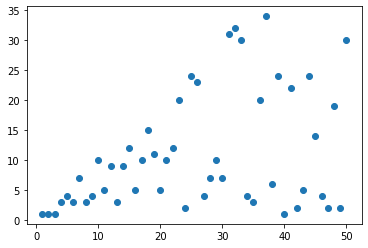
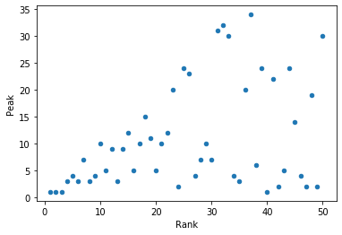
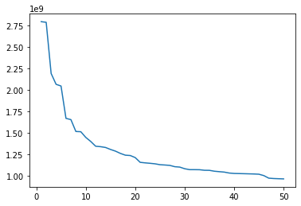
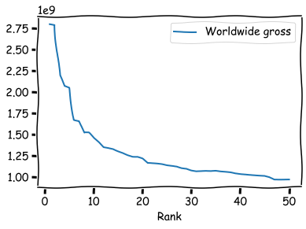
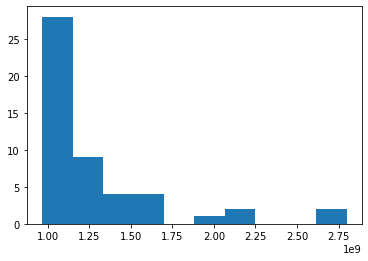
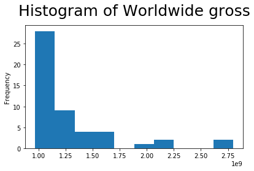
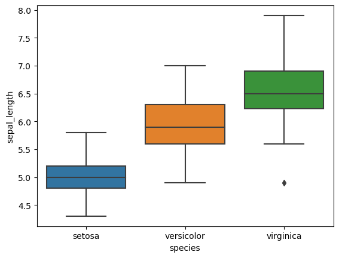
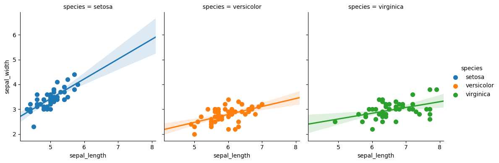
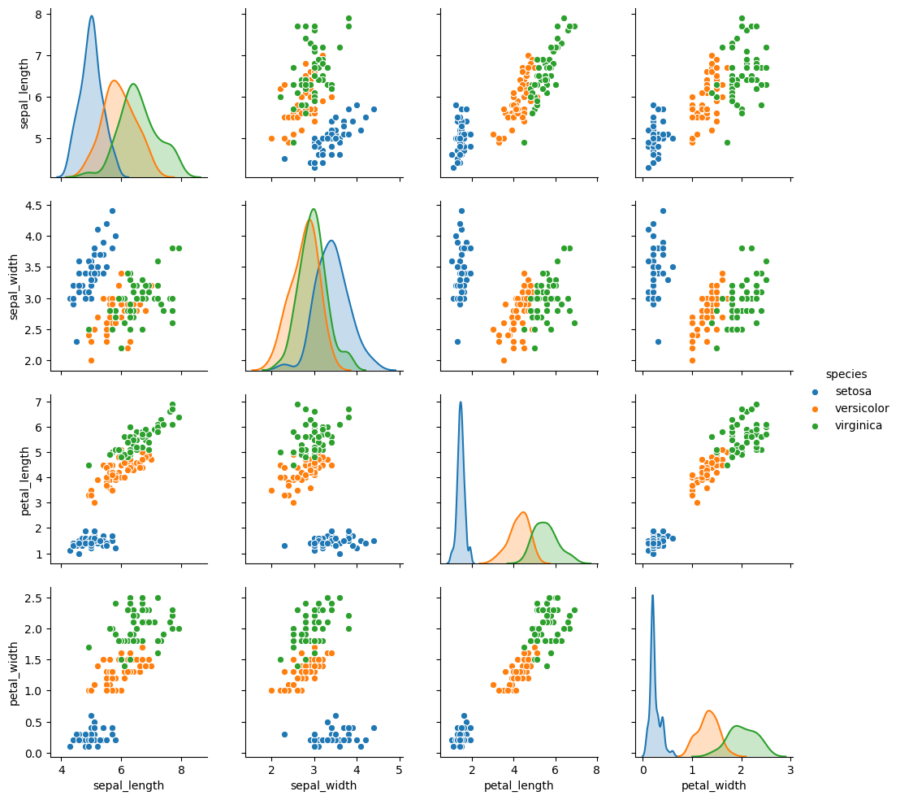

```python
%matplotlib inline
```

# DataFrame in Pandas

Dataframe are a data structure equivalent to individual tables in a database.

Nowadays every high level programming language has its own implementation of the same concept

A dataframe is a table, indicized with rows and columns.

Imagine a table containing information about people:
* each row represent a person and is uniquely associate to the by the row index
* each column represent something measured about that person

### [python: Pandas DataFrames](http://pandas.pydata.org/)

### [R: dataframes](https://en.wikibooks.org/wiki/R_Programming/Working_with_data_frames)

### [Matlab: Table](http://blogs.mathworks.com/loren/2013/09/10/introduction-to-the-new-matlab-data-types-in-r2013b/)

### [Julia: DataFrames](https://en.wikibooks.org/wiki/Introducing_Julia/DataFrames)


```python
import pandas as pd
print(pd.__version__)
```

    1.2.3


```python
# hidden data generation cell
import pandas as pd

data = pd.DataFrame(
    [
        ('Andrea', 24, 178, 'Male'),
        ('Maria', 33, 154, 'Female'),
        ('Luca', 30, 175, 'Male'),
    ],
    columns=['name', 'age', 'height', 'sex'],
)
data.set_index('name', inplace=True)
```


```python
data
```


<div>
<style scoped>
    .dataframe tbody tr th:only-of-type {
        vertical-align: middle;
    }

    .dataframe tbody tr th {
        vertical-align: top;
    }

    .dataframe thead th {
        text-align: right;
    }
</style>
<table border="1" class="dataframe">
  <thead>
    <tr style="text-align: right;">
      <th></th>
      <th>age</th>
      <th>height</th>
      <th>sex</th>
    </tr>
    <tr>
      <th>name</th>
      <th></th>
      <th></th>
      <th></th>
    </tr>
  </thead>
  <tbody>
    <tr>
      <th>Andrea</th>
      <td>24</td>
      <td>178</td>
      <td>Male</td>
    </tr>
    <tr>
      <th>Maria</th>
      <td>33</td>
      <td>154</td>
      <td>Female</td>
    </tr>
    <tr>
      <th>Luca</th>
      <td>30</td>
      <td>175</td>
      <td>Male</td>
    </tr>
  </tbody>
</table>
</div>


```python
# skipped cell about hierarchical indexes
# Righe e colonne possono avere indici **GERARCHICI**, 
# in cui ho più livelli di indicizzazione delle mie informazioni

import pandas as pd

data = pd.DataFrame(
    [
        ('Andrea', '2015', 'residenza', 'Rimini', 'via stretta 20'),
        ('Andrea', '2015', 'domicilio', 'Bologna', 'via larga 30'),
        ('Andrea', '2016', 'residenza', 'Rimini', 'via stretta 20'),
        ('Andrea', '2016', 'domicilio', 'Bologna', 'via larga 30'),
        ('Giulio', '2015', 'residenza', 'Rimini', 'via giusta 50'),
        ('Giulio', '2015', 'domicilio', 'Bologna', 'via falsa 40'),
        ('Giulio', '2016', 'residenza', 'Bologna', 'via torna 10'),
        ('Giulio', '2016', 'domicilio', 'Bologna', 'via torna 10'),
    ], 
    columns=['nome', 'anno', 'tipologia', 'città', 'indirizzo'],
)
data.set_index(['nome', 'anno', 'tipologia'], inplace=True)
data = data.unstack()
data.columns = data.columns.swaplevel(0, 1)
#data.sortlevel(0, axis=1, inplace=True)
```

Dataframes allow us to collect and manipulat informations in a very comfortable way, and are the central pillar of modern data analysis.

A special role is played by the data that are organized as **TIDY DATA**, term introduced in the community by Wickham in 2010 in his [seminal paper](http://vita.had.co.nz/papers/tidy-data.pdf).

Tidy data is a way of structuring your data that makes analysis, visualization and data maitenance particularly easy.
It is a simplified form of **database normalization**, a series of principles on how to design a good database. 

A tidy dataframe is defined as having the following properties:
* a table represent a single set of measurements
* every measured variable is represented by a column, and contains a single, well defined measurement
* every observed unit is represented by a row

where:

* observation: the physiological informations about a person
* observations units: each person
* variables: age, sex, height, etc...

An experiment will provide several tidy table (a database), connected logically one to the other.


```python
import pandas as pd

data = pd.DataFrame(
    [
        ('Andrea', '2015', 'residenza', 'Rimini', 'via stretta 20'),
        ('Andrea', '2015', 'domicilio', 'Bologna', 'via larga 30'),
        ('Andrea', '2016', 'residenza', 'Rimini', 'via stretta 20'),
        ('Andrea', '2016', 'domicilio', 'Bologna', 'via larga 30'),
        ('Giulio', '2015', 'residenza', 'Rimini', 'via giusta 50'),
        ('Giulio', '2015', 'domicilio', 'Bologna', 'via falsa 40'),
        ('Giulio', '2016', 'residenza', 'Bologna', 'via torna 10'),
        ('Giulio', '2016', 'domicilio', 'Bologna', 'via torna 10'),
    ], 
    columns=['nome', 'anno', 'tipologia', 'città', 'indirizzo'],
)
```


```python
data
```


<div>
<style scoped>
    .dataframe tbody tr th:only-of-type {
        vertical-align: middle;
    }

    .dataframe tbody tr th {
        vertical-align: top;
    }

    .dataframe thead th {
        text-align: right;
    }
</style>
<table border="1" class="dataframe">
  <thead>
    <tr style="text-align: right;">
      <th></th>
      <th>nome</th>
      <th>anno</th>
      <th>tipologia</th>
      <th>città</th>
      <th>indirizzo</th>
    </tr>
  </thead>
  <tbody>
    <tr>
      <th>0</th>
      <td>Andrea</td>
      <td>2015</td>
      <td>residenza</td>
      <td>Rimini</td>
      <td>via stretta 20</td>
    </tr>
    <tr>
      <th>1</th>
      <td>Andrea</td>
      <td>2015</td>
      <td>domicilio</td>
      <td>Bologna</td>
      <td>via larga 30</td>
    </tr>
    <tr>
      <th>2</th>
      <td>Andrea</td>
      <td>2016</td>
      <td>residenza</td>
      <td>Rimini</td>
      <td>via stretta 20</td>
    </tr>
    <tr>
      <th>3</th>
      <td>Andrea</td>
      <td>2016</td>
      <td>domicilio</td>
      <td>Bologna</td>
      <td>via larga 30</td>
    </tr>
    <tr>
      <th>4</th>
      <td>Giulio</td>
      <td>2015</td>
      <td>residenza</td>
      <td>Rimini</td>
      <td>via giusta 50</td>
    </tr>
    <tr>
      <th>5</th>
      <td>Giulio</td>
      <td>2015</td>
      <td>domicilio</td>
      <td>Bologna</td>
      <td>via falsa 40</td>
    </tr>
    <tr>
      <th>6</th>
      <td>Giulio</td>
      <td>2016</td>
      <td>residenza</td>
      <td>Bologna</td>
      <td>via torna 10</td>
    </tr>
    <tr>
      <th>7</th>
      <td>Giulio</td>
      <td>2016</td>
      <td>domicilio</td>
      <td>Bologna</td>
      <td>via torna 10</td>
    </tr>
  </tbody>
</table>
</div>


The important thing to remember with this type of data is that this **might not be the ideal format for the analysis** you have in mind.

The tidy format is brilliant, especially for **long term storage and to keep the metadata about the measurements**, but some analysis might need the data to be transformed in non-tidy formats (for example to evaluate differences in various time points)

For this reason, all the libraries that manage dataframe have a **strong focus on data transformation**, reshaping the data from one form to the other.
This allows to easily obtain the best structure for the analysis we want to do without sacrificing the data quality in long term storage.

# Introduction to Pandas

**pandas** is the main library in python that allows one to manipulated dataframe structures.

The library introduces the class **DataFrame**, that holds a single table made out of various **Series**, that represents each column, all sharing the same index

One of the strenghts of pandas is the ability to read and write almost any tabular format.

For example we can download and parse tables from a wikipedia page with a single command

We will discuss:

* reading and preprocessing the dataframe
* performing selections on it
* dataframe manipulation:
    * groupby
    * joins
    * pivoting
* simple visualization
* advanced visualization


```python
import pandas as pd
# import lxml - required for the download
import numpy as np
```


```python
page = 'https://en.wikipedia.org/wiki/List_of_highest-grossing_films'
wikitables = pd.read_html(page)
```


```python
len(wikitables)
```


    92


The page contains several tables, and we obtain a list with all of them.

The one we are interested about is the first one, the proper table of the highest grossing movies.


```python
wikitables[0].head()
```


<div>
<style scoped>
    .dataframe tbody tr th:only-of-type {
        vertical-align: middle;
    }

    .dataframe tbody tr th {
        vertical-align: top;
    }

    .dataframe thead th {
        text-align: right;
    }
</style>
<table border="1" class="dataframe">
  <thead>
    <tr style="text-align: right;">
      <th></th>
      <th>Rank</th>
      <th>Peak</th>
      <th>Title</th>
      <th>Worldwide gross</th>
      <th>Year</th>
      <th>Reference(s)</th>
    </tr>
  </thead>
  <tbody>
    <tr>
      <th>0</th>
      <td>1</td>
      <td>1</td>
      <td>Avengers: Endgame</td>
      <td>$2,797,800,564</td>
      <td>2019</td>
      <td>[# 1][# 2]</td>
    </tr>
    <tr>
      <th>1</th>
      <td>2</td>
      <td>1</td>
      <td>Avatar</td>
      <td>$2,790,439,000</td>
      <td>2009</td>
      <td>[# 3][# 4]</td>
    </tr>
    <tr>
      <th>2</th>
      <td>3</td>
      <td>1</td>
      <td>Titanic</td>
      <td>$2,194,439,542</td>
      <td>1997</td>
      <td>[# 5][# 6]</td>
    </tr>
    <tr>
      <th>3</th>
      <td>4</td>
      <td>3</td>
      <td>Star Wars: The Force Awakens</td>
      <td>$2,068,223,624</td>
      <td>2015</td>
      <td>[# 7][# 8]</td>
    </tr>
    <tr>
      <th>4</th>
      <td>5</td>
      <td>4</td>
      <td>Avengers: Infinity War</td>
      <td>$2,048,359,754</td>
      <td>2018</td>
      <td>[# 9][# 10]</td>
    </tr>
  </tbody>
</table>
</div>


Reading functions contain tens of parameters to allow us to read the data exactly as we need them.


```python
wikitables = pd.read_html(
    page,
    attrs={"class":"wikitable sortable plainrowheaders"},
    index_col='Rank',
)
wikitables[0].head()
```


<div>
<style scoped>
    .dataframe tbody tr th:only-of-type {
        vertical-align: middle;
    }

    .dataframe tbody tr th {
        vertical-align: top;
    }

    .dataframe thead th {
        text-align: right;
    }
</style>
<table border="1" class="dataframe">
  <thead>
    <tr style="text-align: right;">
      <th></th>
      <th>Peak</th>
      <th>Title</th>
      <th>Worldwide gross</th>
      <th>Year</th>
      <th>Reference(s)</th>
    </tr>
    <tr>
      <th>Rank</th>
      <th></th>
      <th></th>
      <th></th>
      <th></th>
      <th></th>
    </tr>
  </thead>
  <tbody>
    <tr>
      <th>1</th>
      <td>1</td>
      <td>Avengers: Endgame</td>
      <td>$2,797,800,564</td>
      <td>2019</td>
      <td>[# 1][# 2]</td>
    </tr>
    <tr>
      <th>2</th>
      <td>1</td>
      <td>Avatar</td>
      <td>$2,790,439,000</td>
      <td>2009</td>
      <td>[# 3][# 4]</td>
    </tr>
    <tr>
      <th>3</th>
      <td>1</td>
      <td>Titanic</td>
      <td>$2,194,439,542</td>
      <td>1997</td>
      <td>[# 5][# 6]</td>
    </tr>
    <tr>
      <th>4</th>
      <td>3</td>
      <td>Star Wars: The Force Awakens</td>
      <td>$2,068,223,624</td>
      <td>2015</td>
      <td>[# 7][# 8]</td>
    </tr>
    <tr>
      <th>5</th>
      <td>4</td>
      <td>Avengers: Infinity War</td>
      <td>$2,048,359,754</td>
      <td>2018</td>
      <td>[# 9][# 10]</td>
    </tr>
  </tbody>
</table>
</div>


```python
# percentage variation
url = "https://www.statbureau.org/en/united-states/inflation-tables/inflation.monthly.csv"
temp = pd.read_csv(url, index_col='Year')
temp.columns = [col.strip() for col in temp.columns]
totals = temp[['Total']]
del temp['Total']
fractional_variation =(temp.stack()+100)/100
fractional_variation = fractional_variation.cumprod()
```


```python
wikitables = pd.read_html(page)
dataframe = wikitables[0].copy()
```

The dataframe behave similarly to a dictionary.

the column names are the keys, and the values are the Series associated with those names


```python
dataframe.columns
```


    Index(['Rank', 'Peak', 'Title', 'Worldwide gross', 'Year', 'Reference(s)'], dtype='object')


```python
dataframe['Year'].head()
```


    0    2019
    1    2009
    2    1997
    3    2015
    4    2018
    Name: Year, dtype: int64


## Series

Series behave similarly to numpy array in regards to vectorization, but they join values based on the index and not the order of the elements


```python
dataframe['Year'].head() * 100
```


    0    201900
    1    200900
    2    199700
    3    201500
    4    201800
    Name: Year, dtype: int64


```python
a = pd.Series(
    [1, 2, 3],
    index=['a', 'b', 'c'],
)
a
```


    a    1
    b    2
    c    3
    dtype: int64


```python
b = pd.Series(
    [5, 6, 7],
    index=['c', 'a', 'b'],
)
b
```


    c    5
    a    6
    b    7
    dtype: int64


```python
a+b
```


    a    7
    b    9
    c    8
    dtype: int64


Series and DataFrames inherit also the slicing properties of numpy arrays


```python
a = pd.Series(
    [1, 2, 3], 
    index=['a', 'b', 'c'],
)
a>1
```


    a    False
    b     True
    c     True
    dtype: bool


```python
a[a>1]
```


    b    2
    c    3
    dtype: int64


```python
a = pd.Series(
    [1, 2, 3, 4, 5, 6],
    index=['a', 'b', 'c', 'd', 'e', 'f'],
)
idx_1 = a>2
idx_2 = a<5
a[idx_1 & idx_2]
```


    c    3
    d    4
    dtype: int64


They can be sliced on the index as well, both by single keys and range of keys.

the range of keys are referred to the order of the index, not the natural sorting of the values contained in it

**NOTE: the slicing also contains the last value of the slice as well!**


```python
a['a']
```


    1


```python
a['a':'b']
```


    a    1
    b    2
    dtype: int64


```python
b = pd.Series([5, 6, 7], index=['c', 'a', 'b'])
b['c':'a']
```


    c    5
    a    6
    dtype: int64


## Series as elements of a DataFrame

I can manipulate columns in various ways, starting from the possibility of removing unwanted ones


```python
del dataframe['Reference(s)']
```


```python
dataframe.head()
```


<div>
<style scoped>
    .dataframe tbody tr th:only-of-type {
        vertical-align: middle;
    }

    .dataframe tbody tr th {
        vertical-align: top;
    }

    .dataframe thead th {
        text-align: right;
    }
</style>
<table border="1" class="dataframe">
  <thead>
    <tr style="text-align: right;">
      <th></th>
      <th>Rank</th>
      <th>Peak</th>
      <th>Title</th>
      <th>Worldwide gross</th>
      <th>Year</th>
    </tr>
  </thead>
  <tbody>
    <tr>
      <th>0</th>
      <td>1</td>
      <td>1</td>
      <td>Avengers: Endgame</td>
      <td>$2,797,800,564</td>
      <td>2019</td>
    </tr>
    <tr>
      <th>1</th>
      <td>2</td>
      <td>1</td>
      <td>Avatar</td>
      <td>$2,790,439,000</td>
      <td>2009</td>
    </tr>
    <tr>
      <th>2</th>
      <td>3</td>
      <td>1</td>
      <td>Titanic</td>
      <td>$2,194,439,542</td>
      <td>1997</td>
    </tr>
    <tr>
      <th>3</th>
      <td>4</td>
      <td>3</td>
      <td>Star Wars: The Force Awakens</td>
      <td>$2,068,223,624</td>
      <td>2015</td>
    </tr>
    <tr>
      <th>4</th>
      <td>5</td>
      <td>4</td>
      <td>Avengers: Infinity War</td>
      <td>$2,048,359,754</td>
      <td>2018</td>
    </tr>
  </tbody>
</table>
</div>


```python
dataframe.info()
```

    <class 'pandas.core.frame.DataFrame'>
    RangeIndex: 50 entries, 0 to 49
    Data columns (total 5 columns):
     #   Column           Non-Null Count  Dtype 
    ---  ------           --------------  ----- 
     0   Rank             50 non-null     int64 
     1   Peak             50 non-null     object
     2   Title            50 non-null     object
     3   Worldwide gross  50 non-null     object
     4   Year             50 non-null     int64 
    dtypes: int64(2), object(3)
    memory usage: 1.4+ KB


```python
dataframe.select_dtypes(include='int64').head()
```


<div>
<style scoped>
    .dataframe tbody tr th:only-of-type {
        vertical-align: middle;
    }

    .dataframe tbody tr th {
        vertical-align: top;
    }

    .dataframe thead th {
        text-align: right;
    }
</style>
<table border="1" class="dataframe">
  <thead>
    <tr style="text-align: right;">
      <th></th>
      <th>Rank</th>
      <th>Year</th>
    </tr>
  </thead>
  <tbody>
    <tr>
      <th>0</th>
      <td>1</td>
      <td>2019</td>
    </tr>
    <tr>
      <th>1</th>
      <td>2</td>
      <td>2009</td>
    </tr>
    <tr>
      <th>2</th>
      <td>3</td>
      <td>1997</td>
    </tr>
    <tr>
      <th>3</th>
      <td>4</td>
      <td>2015</td>
    </tr>
    <tr>
      <th>4</th>
      <td>5</td>
      <td>2018</td>
    </tr>
  </tbody>
</table>
</div>


```python
dataframe.select_dtypes(include=np.number).head()
```


<div>
<style scoped>
    .dataframe tbody tr th:only-of-type {
        vertical-align: middle;
    }

    .dataframe tbody tr th {
        vertical-align: top;
    }

    .dataframe thead th {
        text-align: right;
    }
</style>
<table border="1" class="dataframe">
  <thead>
    <tr style="text-align: right;">
      <th></th>
      <th>Rank</th>
      <th>Year</th>
    </tr>
  </thead>
  <tbody>
    <tr>
      <th>0</th>
      <td>1</td>
      <td>2019</td>
    </tr>
    <tr>
      <th>1</th>
      <td>2</td>
      <td>2009</td>
    </tr>
    <tr>
      <th>2</th>
      <td>3</td>
      <td>1997</td>
    </tr>
    <tr>
      <th>3</th>
      <td>4</td>
      <td>2015</td>
    </tr>
    <tr>
      <th>4</th>
      <td>5</td>
      <td>2018</td>
    </tr>
  </tbody>
</table>
</div>


```python
dataframe['Title'].head()
```


    0               Avengers: Endgame
    1                          Avatar
    2                         Titanic
    3    Star Wars: The Force Awakens
    4          Avengers: Infinity War
    Name: Title, dtype: object


```python
dataframe.sort_values('Year').head()
```


<div>
<style scoped>
    .dataframe tbody tr th:only-of-type {
        vertical-align: middle;
    }

    .dataframe tbody tr th {
        vertical-align: top;
    }

    .dataframe thead th {
        text-align: right;
    }
</style>
<table border="1" class="dataframe">
  <thead>
    <tr style="text-align: right;">
      <th></th>
      <th>Rank</th>
      <th>Peak</th>
      <th>Title</th>
      <th>Worldwide gross</th>
      <th>Year</th>
    </tr>
  </thead>
  <tbody>
    <tr>
      <th>39</th>
      <td>40</td>
      <td>1</td>
      <td>Jurassic Park</td>
      <td>$1,029,939,903</td>
      <td>1993</td>
    </tr>
    <tr>
      <th>48</th>
      <td>49</td>
      <td>2</td>
      <td>The Lion King</td>
      <td>$968,483,777</td>
      <td>1994</td>
    </tr>
    <tr>
      <th>2</th>
      <td>3</td>
      <td>1</td>
      <td>Titanic</td>
      <td>$2,194,439,542</td>
      <td>1997</td>
    </tr>
    <tr>
      <th>41</th>
      <td>42</td>
      <td>2</td>
      <td>Star Wars: Episode I – The Phantom Menace</td>
      <td>$1,027,044,677</td>
      <td>1999</td>
    </tr>
    <tr>
      <th>46</th>
      <td>47</td>
      <td>2PS</td>
      <td>Harry Potter and the Philosopher's Stone</td>
      <td>$975,051,288</td>
      <td>2001</td>
    </tr>
  </tbody>
</table>
</div>


```python
dataframe.sort_values('Year', ascending=False).head()
```


<div>
<style scoped>
    .dataframe tbody tr th:only-of-type {
        vertical-align: middle;
    }

    .dataframe tbody tr th {
        vertical-align: top;
    }

    .dataframe thead th {
        text-align: right;
    }
</style>
<table border="1" class="dataframe">
  <thead>
    <tr style="text-align: right;">
      <th></th>
      <th>Rank</th>
      <th>Peak</th>
      <th>Title</th>
      <th>Worldwide gross</th>
      <th>Year</th>
    </tr>
  </thead>
  <tbody>
    <tr>
      <th>0</th>
      <td>1</td>
      <td>1</td>
      <td>Avengers: Endgame</td>
      <td>$2,797,800,564</td>
      <td>2019</td>
    </tr>
    <tr>
      <th>9</th>
      <td>10</td>
      <td>10</td>
      <td>Frozen II</td>
      <td>$1,450,026,933</td>
      <td>2019</td>
    </tr>
    <tr>
      <th>36</th>
      <td>37</td>
      <td>34</td>
      <td>Aladdin</td>
      <td>$1,050,693,953</td>
      <td>2019</td>
    </tr>
    <tr>
      <th>32</th>
      <td>33</td>
      <td>30</td>
      <td>Toy Story 4</td>
      <td>$1,073,394,593</td>
      <td>2019</td>
    </tr>
    <tr>
      <th>31</th>
      <td>32</td>
      <td>32</td>
      <td>Star Wars: The Rise of Skywalker</td>
      <td>$1,074,144,248</td>
      <td>2019</td>
    </tr>
  </tbody>
</table>
</div>


```python
dataframe.query("Year>=2017")
```


<div>
<style scoped>
    .dataframe tbody tr th:only-of-type {
        vertical-align: middle;
    }

    .dataframe tbody tr th {
        vertical-align: top;
    }

    .dataframe thead th {
        text-align: right;
    }
</style>
<table border="1" class="dataframe">
  <thead>
    <tr style="text-align: right;">
      <th></th>
      <th>Rank</th>
      <th>Peak</th>
      <th>Title</th>
      <th>Worldwide gross</th>
      <th>Year</th>
    </tr>
  </thead>
  <tbody>
    <tr>
      <th>0</th>
      <td>1</td>
      <td>1</td>
      <td>Avengers: Endgame</td>
      <td>$2,797,800,564</td>
      <td>2019</td>
    </tr>
    <tr>
      <th>4</th>
      <td>5</td>
      <td>4</td>
      <td>Avengers: Infinity War</td>
      <td>$2,048,359,754</td>
      <td>2018</td>
    </tr>
    <tr>
      <th>6</th>
      <td>7</td>
      <td>7</td>
      <td>The Lion King</td>
      <td>$1,656,943,394</td>
      <td>2019</td>
    </tr>
    <tr>
      <th>9</th>
      <td>10</td>
      <td>10</td>
      <td>Frozen II</td>
      <td>$1,450,026,933</td>
      <td>2019</td>
    </tr>
    <tr>
      <th>11</th>
      <td>12</td>
      <td>9</td>
      <td>Black Panther</td>
      <td>$1,346,913,161</td>
      <td>2018</td>
    </tr>
    <tr>
      <th>13</th>
      <td>14</td>
      <td>9</td>
      <td>Star Wars: The Last Jedi</td>
      <td>$1,332,539,889</td>
      <td>2017</td>
    </tr>
    <tr>
      <th>14</th>
      <td>15</td>
      <td>12</td>
      <td>Jurassic World: Fallen Kingdom</td>
      <td>$1,309,484,461</td>
      <td>2018</td>
    </tr>
    <tr>
      <th>16</th>
      <td>17</td>
      <td>10</td>
      <td>Beauty and the Beast</td>
      <td>$1,263,521,126</td>
      <td>2017</td>
    </tr>
    <tr>
      <th>17</th>
      <td>18</td>
      <td>15</td>
      <td>Incredibles 2</td>
      <td>$1,242,805,359</td>
      <td>2018</td>
    </tr>
    <tr>
      <th>18</th>
      <td>19</td>
      <td>11</td>
      <td>The Fate of the Furious</td>
      <td>F8$1,238,764,765</td>
      <td>2017</td>
    </tr>
    <tr>
      <th>22</th>
      <td>23</td>
      <td>20</td>
      <td>Aquaman</td>
      <td>$1,148,161,807</td>
      <td>2018</td>
    </tr>
    <tr>
      <th>24</th>
      <td>25</td>
      <td>24</td>
      <td>Spider-Man: Far From Home</td>
      <td>$1,131,927,996</td>
      <td>2019</td>
    </tr>
    <tr>
      <th>25</th>
      <td>26</td>
      <td>23</td>
      <td>Captain Marvel</td>
      <td>$1,128,274,794</td>
      <td>2019</td>
    </tr>
    <tr>
      <th>30</th>
      <td>31</td>
      <td>31</td>
      <td>Joker</td>
      <td>$1,074,251,311</td>
      <td>2019</td>
    </tr>
    <tr>
      <th>31</th>
      <td>32</td>
      <td>32</td>
      <td>Star Wars: The Rise of Skywalker</td>
      <td>$1,074,144,248</td>
      <td>2019</td>
    </tr>
    <tr>
      <th>32</th>
      <td>33</td>
      <td>30</td>
      <td>Toy Story 4</td>
      <td>$1,073,394,593</td>
      <td>2019</td>
    </tr>
    <tr>
      <th>36</th>
      <td>37</td>
      <td>34</td>
      <td>Aladdin</td>
      <td>$1,050,693,953</td>
      <td>2019</td>
    </tr>
    <tr>
      <th>38</th>
      <td>39</td>
      <td>24</td>
      <td>Despicable Me 3</td>
      <td>$1,034,799,409</td>
      <td>2017</td>
    </tr>
  </tbody>
</table>
</div>


```python
selection = dataframe['Year']>=2017
selection.head()
```


    0     True
    1    False
    2    False
    3    False
    4     True
    Name: Year, dtype: bool


```python
dataframe[selection]
```


<div>
<style scoped>
    .dataframe tbody tr th:only-of-type {
        vertical-align: middle;
    }

    .dataframe tbody tr th {
        vertical-align: top;
    }

    .dataframe thead th {
        text-align: right;
    }
</style>
<table border="1" class="dataframe">
  <thead>
    <tr style="text-align: right;">
      <th></th>
      <th>Rank</th>
      <th>Peak</th>
      <th>Title</th>
      <th>Worldwide gross</th>
      <th>Year</th>
    </tr>
  </thead>
  <tbody>
    <tr>
      <th>0</th>
      <td>1</td>
      <td>1</td>
      <td>Avengers: Endgame</td>
      <td>$2,797,800,564</td>
      <td>2019</td>
    </tr>
    <tr>
      <th>4</th>
      <td>5</td>
      <td>4</td>
      <td>Avengers: Infinity War</td>
      <td>$2,048,359,754</td>
      <td>2018</td>
    </tr>
    <tr>
      <th>6</th>
      <td>7</td>
      <td>7</td>
      <td>The Lion King</td>
      <td>$1,656,943,394</td>
      <td>2019</td>
    </tr>
    <tr>
      <th>9</th>
      <td>10</td>
      <td>10</td>
      <td>Frozen II</td>
      <td>$1,450,026,933</td>
      <td>2019</td>
    </tr>
    <tr>
      <th>11</th>
      <td>12</td>
      <td>9</td>
      <td>Black Panther</td>
      <td>$1,346,913,161</td>
      <td>2018</td>
    </tr>
    <tr>
      <th>13</th>
      <td>14</td>
      <td>9</td>
      <td>Star Wars: The Last Jedi</td>
      <td>$1,332,539,889</td>
      <td>2017</td>
    </tr>
    <tr>
      <th>14</th>
      <td>15</td>
      <td>12</td>
      <td>Jurassic World: Fallen Kingdom</td>
      <td>$1,309,484,461</td>
      <td>2018</td>
    </tr>
    <tr>
      <th>16</th>
      <td>17</td>
      <td>10</td>
      <td>Beauty and the Beast</td>
      <td>$1,263,521,126</td>
      <td>2017</td>
    </tr>
    <tr>
      <th>17</th>
      <td>18</td>
      <td>15</td>
      <td>Incredibles 2</td>
      <td>$1,242,805,359</td>
      <td>2018</td>
    </tr>
    <tr>
      <th>18</th>
      <td>19</td>
      <td>11</td>
      <td>The Fate of the Furious</td>
      <td>F8$1,238,764,765</td>
      <td>2017</td>
    </tr>
    <tr>
      <th>22</th>
      <td>23</td>
      <td>20</td>
      <td>Aquaman</td>
      <td>$1,148,161,807</td>
      <td>2018</td>
    </tr>
    <tr>
      <th>24</th>
      <td>25</td>
      <td>24</td>
      <td>Spider-Man: Far From Home</td>
      <td>$1,131,927,996</td>
      <td>2019</td>
    </tr>
    <tr>
      <th>25</th>
      <td>26</td>
      <td>23</td>
      <td>Captain Marvel</td>
      <td>$1,128,274,794</td>
      <td>2019</td>
    </tr>
    <tr>
      <th>30</th>
      <td>31</td>
      <td>31</td>
      <td>Joker</td>
      <td>$1,074,251,311</td>
      <td>2019</td>
    </tr>
    <tr>
      <th>31</th>
      <td>32</td>
      <td>32</td>
      <td>Star Wars: The Rise of Skywalker</td>
      <td>$1,074,144,248</td>
      <td>2019</td>
    </tr>
    <tr>
      <th>32</th>
      <td>33</td>
      <td>30</td>
      <td>Toy Story 4</td>
      <td>$1,073,394,593</td>
      <td>2019</td>
    </tr>
    <tr>
      <th>36</th>
      <td>37</td>
      <td>34</td>
      <td>Aladdin</td>
      <td>$1,050,693,953</td>
      <td>2019</td>
    </tr>
    <tr>
      <th>38</th>
      <td>39</td>
      <td>24</td>
      <td>Despicable Me 3</td>
      <td>$1,034,799,409</td>
      <td>2017</td>
    </tr>
  </tbody>
</table>
</div>


## Dataframe manipulation

Often real data arrives in a format that can only be described as "far from optimal"

The first (and major) part of data analysis is data cleaning and preprocessing in a decent form

In our case, for example, we might need to adjust the earning of each movies, as we would like to treat them as a number and not strings


```python
c = 'Worldwide gross'
dataframe[c].str.split('$').head()
```


    0    [, 2,797,800,564]
    1    [, 2,790,439,000]
    2    [, 2,194,439,542]
    3    [, 2,068,223,624]
    4    [, 2,048,359,754]
    Name: Worldwide gross, dtype: object


```python
dataframe[c].str.split('$').str[-1].head()
```


    0    2,797,800,564
    1    2,790,439,000
    2    2,194,439,542
    3    2,068,223,624
    4    2,048,359,754
    Name: Worldwide gross, dtype: object


```python
dataframe[c] = dataframe[c].str.split('$').str[-1]
dataframe[c] = dataframe[c].str.replace(',', '')
dataframe[c] = dataframe[c].astype(np.int64)
```


```python
dataframe.info()
```

    <class 'pandas.core.frame.DataFrame'>
    RangeIndex: 50 entries, 0 to 49
    Data columns (total 5 columns):
     #   Column           Non-Null Count  Dtype 
    ---  ------           --------------  ----- 
     0   Rank             50 non-null     int64 
     1   Peak             50 non-null     object
     2   Title            50 non-null     object
     3   Worldwide gross  50 non-null     int64 
     4   Year             50 non-null     int64 
    dtypes: int64(3), object(2)
    memory usage: 1.6+ KB


Sometimes, one needs to use some violence...


```python
try:
    dataframe['Peak'].astype(int)
except ValueError as e:
    print(e)
```

    invalid literal for int() with base 10: '4TS3'


```python
print(list(dataframe['Peak'].unique()))
```

    ['1', '3', '4', '7', '10', '5', '9', '12', '15', '11', '20', '2', '24', '23', '31', '32', '30', '4TS3', '34', '6', '22', '14', '2PS', '19DM2']


Given that there is no simple transformation, we need to use **regular expressions**.

regular expression are a way to express text structure and to specify which part to extract from it


```python
import re
regex = re.compile('(\d+)\D*\d*')
regex = re.compile(
    '(\d+)' # extract this group, composed of one or more digits
    '\D*' # can be followed by 0 or more non digits
    '\d*' # can be followed by 0 or more digits
)
dataframe['Peak'] = dataframe['Peak'].str.extract(regex, expand=False)
dataframe['Peak'] = dataframe['Peak'].astype(int)
```


```python
dataframe.info()
```

    <class 'pandas.core.frame.DataFrame'>
    RangeIndex: 50 entries, 0 to 49
    Data columns (total 5 columns):
     #   Column           Non-Null Count  Dtype 
    ---  ------           --------------  ----- 
     0   Rank             50 non-null     int64 
     1   Peak             50 non-null     int32 
     2   Title            50 non-null     object
     3   Worldwide gross  50 non-null     int64 
     4   Year             50 non-null     int64 
    dtypes: int32(1), int64(3), object(1)
    memory usage: 1.6+ KB


```python
dataframe['Rank'] = dataframe['Rank'].astype(np.int64)
```


```python
dataframe.info()
```

    <class 'pandas.core.frame.DataFrame'>
    RangeIndex: 50 entries, 0 to 49
    Data columns (total 5 columns):
     #   Column           Non-Null Count  Dtype 
    ---  ------           --------------  ----- 
     0   Rank             50 non-null     int64 
     1   Peak             50 non-null     int32 
     2   Title            50 non-null     object
     3   Worldwide gross  50 non-null     int64 
     4   Year             50 non-null     int64 
    dtypes: int32(1), int64(3), object(1)
    memory usage: 1.6+ KB


```python
dataframe.describe()
```


<div>
<style scoped>
    .dataframe tbody tr th:only-of-type {
        vertical-align: middle;
    }

    .dataframe tbody tr th {
        vertical-align: top;
    }

    .dataframe thead th {
        text-align: right;
    }
</style>
<table border="1" class="dataframe">
  <thead>
    <tr style="text-align: right;">
      <th></th>
      <th>Rank</th>
      <th>Peak</th>
      <th>Worldwide gross</th>
      <th>Year</th>
    </tr>
  </thead>
  <tbody>
    <tr>
      <th>count</th>
      <td>50.00000</td>
      <td>50.000000</td>
      <td>5.000000e+01</td>
      <td>50.000000</td>
    </tr>
    <tr>
      <th>mean</th>
      <td>25.50000</td>
      <td>10.980000</td>
      <td>1.291294e+09</td>
      <td>2012.960000</td>
    </tr>
    <tr>
      <th>std</th>
      <td>14.57738</td>
      <td>9.725812</td>
      <td>4.193347e+08</td>
      <td>6.639277</td>
    </tr>
    <tr>
      <th>min</th>
      <td>1.00000</td>
      <td>1.000000</td>
      <td>9.665506e+08</td>
      <td>1993.000000</td>
    </tr>
    <tr>
      <th>25%</th>
      <td>13.25000</td>
      <td>3.250000</td>
      <td>1.046959e+09</td>
      <td>2011.000000</td>
    </tr>
    <tr>
      <th>50%</th>
      <td>25.50000</td>
      <td>7.000000</td>
      <td>1.130101e+09</td>
      <td>2015.000000</td>
    </tr>
    <tr>
      <th>75%</th>
      <td>37.75000</td>
      <td>18.000000</td>
      <td>1.339405e+09</td>
      <td>2018.000000</td>
    </tr>
    <tr>
      <th>max</th>
      <td>50.00000</td>
      <td>34.000000</td>
      <td>2.797801e+09</td>
      <td>2019.000000</td>
    </tr>
  </tbody>
</table>
</div>


## DataFrame visualization

We can do it with both matplotlib and pandas.

both have special methods to display the data contained in a dataframe.

Later on we will see a more appropriate library, **seaborn**, but for now we will use a *quick & dirty* approach


```python
import pylab as plt
```


```python
plt.scatter('Rank', 'Peak', data=dataframe)
```


    <matplotlib.collections.PathCollection at 0x1925370>


    

    


```python
dataframe.plot.scatter('Rank', 'Peak')
```


    <matplotlib.axes._subplots.AxesSubplot at 0x19af510>


    

    


```python
plt.plot('Rank', 'Worldwide gross', data=dataframe)
```


    [<matplotlib.lines.Line2D at 0x4b9b710>]


    

    


```python
with plt.xkcd():
    dataframe.plot('Rank', 'Worldwide gross')
```


    

    


```python
plt.hist('Worldwide gross', data=dataframe);
```


    

    


```python
dataframe['Worldwide gross'].plot.hist()
```


    <matplotlib.axes._subplots.AxesSubplot at 0x4cbb9d0>


    

    


pandas is actually just creating a matplotlib plot under the hood, so you can just extract it and modify it as any other plot


```python
dataframe['Worldwide gross'].plot.hist()
ax = plt.gca()
fig = plt.gcf()
ax.set_title("Histogram of Worldwide gross", fontsize=25, y=1.05)
fig.tight_layout()
```


    

    


### Multidimensional dataframes using XArray

Pandas dataframes (and in general the dataframe structure) is designed to represent data stored in table form, with columns and rows, containing scalar data such as height, weight, age and so on...

For more complicated data, where different kind of data structure need to be related to each other while keeping most of the goodies that pandas provides, an alternative is [**XArray**](http://xarray.pydata.org/en/stable/).

This library includes the equivalent of the pandas dataframe and series (**DataArray** and **DataSet**), that provide an efficient and comfortable ways to manipulate multidimensional arrays, where several of them share one of more of their indexes

## Manipulation on DataFrames

we will discuss some common operations on dataframes:

* Groupby
* join and merge
* pivot, melt, stackinging

### Groupby

this is a whole family of operations, that can be summarized as:

1. divide the data in various groups
2. apply a transform on these data (mapping or aggregation)
3. merge the results from the previous step

the result of step 3 is going to be a value for group in the case of aggregation operations (sum, average, etc...) or a new versione of the dataframe with the transformed values.


```python
wiki = "https://it.wikipedia.org/wiki/"
url_popolazione = wiki + "Comuni_d%27Italia_per_popolazione"
url_superficie = wiki + "Primi_100_comuni_italiani_per_superficie"
```


```python
comuni_popolazione = pd.read_html(url_popolazione, header=0)
comuni_popolazione = comuni_popolazione[0]
comuni_popolazione.head()
```


<div>
<style scoped>
    .dataframe tbody tr th:only-of-type {
        vertical-align: middle;
    }

    .dataframe tbody tr th {
        vertical-align: top;
    }

    .dataframe thead th {
        text-align: right;
    }
</style>
<table border="1" class="dataframe">
  <thead>
    <tr style="text-align: right;">
      <th></th>
      <th>N°</th>
      <th>Comune</th>
      <th>Regione</th>
      <th>Provincia / Città metropolitana</th>
      <th>Abitanti</th>
    </tr>
  </thead>
  <tbody>
    <tr>
      <th>0</th>
      <td>1</td>
      <td>Roma</td>
      <td>Lazio</td>
      <td>Roma</td>
      <td>2 847 490</td>
    </tr>
    <tr>
      <th>1</th>
      <td>2</td>
      <td>Milano</td>
      <td>Lombardia</td>
      <td>Milano</td>
      <td>1 388 223</td>
    </tr>
    <tr>
      <th>2</th>
      <td>3</td>
      <td>Napoli</td>
      <td>Campania</td>
      <td>Napoli</td>
      <td>955 503</td>
    </tr>
    <tr>
      <th>3</th>
      <td>4</td>
      <td>Torino</td>
      <td>Piemonte</td>
      <td>Torino</td>
      <td>875 063</td>
    </tr>
    <tr>
      <th>4</th>
      <td>5</td>
      <td>Palermo</td>
      <td>Sicilia</td>
      <td>Palermo</td>
      <td>659 052</td>
    </tr>
  </tbody>
</table>
</div>


```python
comuni_superficie = pd.read_html(url_superficie, header=0)
# might change, right now the 0 it's a info box
comuni_superficie = comuni_superficie[1] 
comuni_superficie.head()
```


<div>
<style scoped>
    .dataframe tbody tr th:only-of-type {
        vertical-align: middle;
    }

    .dataframe tbody tr th {
        vertical-align: top;
    }

    .dataframe thead th {
        text-align: right;
    }
</style>
<table border="1" class="dataframe">
  <thead>
    <tr style="text-align: right;">
      <th></th>
      <th>Pos.</th>
      <th>Comune</th>
      <th>Regione</th>
      <th>Provincia</th>
      <th>Superficie (km²)</th>
    </tr>
  </thead>
  <tbody>
    <tr>
      <th>0</th>
      <td>1</td>
      <td>Roma</td>
      <td>Lazio</td>
      <td>Roma</td>
      <td>128736</td>
    </tr>
    <tr>
      <th>1</th>
      <td>2</td>
      <td>Ravenna</td>
      <td>Emilia-Romagna</td>
      <td>Ravenna</td>
      <td>65382</td>
    </tr>
    <tr>
      <th>2</th>
      <td>3</td>
      <td>Cerignola</td>
      <td>Puglia</td>
      <td>Foggia</td>
      <td>59393</td>
    </tr>
    <tr>
      <th>3</th>
      <td>4</td>
      <td>Noto</td>
      <td>Sicilia</td>
      <td>Siracusa</td>
      <td>55499</td>
    </tr>
    <tr>
      <th>4</th>
      <td>5</td>
      <td>Sassari</td>
      <td>Sardegna</td>
      <td>Sassari</td>
      <td>54704</td>
    </tr>
  </tbody>
</table>
</div>


```python
comuni_superficie.groupby('Regione').mean()
```


<div>
<style scoped>
    .dataframe tbody tr th:only-of-type {
        vertical-align: middle;
    }

    .dataframe tbody tr th {
        vertical-align: top;
    }

    .dataframe thead th {
        text-align: right;
    }
</style>
<table border="1" class="dataframe">
  <thead>
    <tr style="text-align: right;">
      <th></th>
      <th>Pos.</th>
      <th>Superficie (km²)</th>
    </tr>
    <tr>
      <th>Regione</th>
      <th></th>
      <th></th>
    </tr>
  </thead>
  <tbody>
    <tr>
      <th>Abruzzo</th>
      <td>9.000000</td>
      <td>47391.000000</td>
    </tr>
    <tr>
      <th>Basilicata</th>
      <td>54.666667</td>
      <td>29641.000000</td>
    </tr>
    <tr>
      <th>Calabria</th>
      <td>52.333333</td>
      <td>28937.666667</td>
    </tr>
    <tr>
      <th>Emilia-Romagna</th>
      <td>56.200000</td>
      <td>31154.100000</td>
    </tr>
    <tr>
      <th>Lazio</th>
      <td>29.250000</td>
      <td>56263.750000</td>
    </tr>
    <tr>
      <th>Liguria</th>
      <td>80.000000</td>
      <td>24029.000000</td>
    </tr>
    <tr>
      <th>Lombardia</th>
      <td>94.500000</td>
      <td>22701.500000</td>
    </tr>
    <tr>
      <th>Marche</th>
      <td>84.333333</td>
      <td>24168.000000</td>
    </tr>
    <tr>
      <th>Puglia</th>
      <td>46.210526</td>
      <td>33034.263158</td>
    </tr>
    <tr>
      <th>Sardegna</th>
      <td>62.625000</td>
      <td>29839.375000</td>
    </tr>
    <tr>
      <th>Sicilia</th>
      <td>46.300000</td>
      <td>32300.150000</td>
    </tr>
    <tr>
      <th>Toscana</th>
      <td>52.142857</td>
      <td>29941.357143</td>
    </tr>
    <tr>
      <th>Trentino-Alto Adige</th>
      <td>56.000000</td>
      <td>27485.000000</td>
    </tr>
    <tr>
      <th>Umbria</th>
      <td>32.142857</td>
      <td>36175.285714</td>
    </tr>
    <tr>
      <th>Veneto</th>
      <td>49.000000</td>
      <td>30853.000000</td>
    </tr>
  </tbody>
</table>
</div>


```python
g = comuni_superficie.groupby('Regione')
g.aggregate([np.mean, np.std, pd.Series.count])
```


<div>
<style scoped>
    .dataframe tbody tr th:only-of-type {
        vertical-align: middle;
    }

    .dataframe tbody tr th {
        vertical-align: top;
    }

    .dataframe thead tr th {
        text-align: left;
    }

    .dataframe thead tr:last-of-type th {
        text-align: right;
    }
</style>
<table border="1" class="dataframe">
  <thead>
    <tr>
      <th></th>
      <th colspan="3" halign="left">Pos.</th>
      <th colspan="3" halign="left">Superficie (km²)</th>
    </tr>
    <tr>
      <th></th>
      <th>mean</th>
      <th>std</th>
      <th>count</th>
      <th>mean</th>
      <th>std</th>
      <th>count</th>
    </tr>
    <tr>
      <th>Regione</th>
      <th></th>
      <th></th>
      <th></th>
      <th></th>
      <th></th>
      <th></th>
    </tr>
  </thead>
  <tbody>
    <tr>
      <th>Abruzzo</th>
      <td>9.000000</td>
      <td>NaN</td>
      <td>1</td>
      <td>47391.000000</td>
      <td>NaN</td>
      <td>1</td>
    </tr>
    <tr>
      <th>Basilicata</th>
      <td>54.666667</td>
      <td>33.321665</td>
      <td>3</td>
      <td>29641.000000</td>
      <td>8419.030110</td>
      <td>3</td>
    </tr>
    <tr>
      <th>Calabria</th>
      <td>52.333333</td>
      <td>26.407070</td>
      <td>3</td>
      <td>28937.666667</td>
      <td>5408.599850</td>
      <td>3</td>
    </tr>
    <tr>
      <th>Emilia-Romagna</th>
      <td>56.200000</td>
      <td>30.828558</td>
      <td>10</td>
      <td>31154.100000</td>
      <td>13146.217719</td>
      <td>10</td>
    </tr>
    <tr>
      <th>Lazio</th>
      <td>29.250000</td>
      <td>24.743686</td>
      <td>4</td>
      <td>56263.750000</td>
      <td>48688.754926</td>
      <td>4</td>
    </tr>
    <tr>
      <th>Liguria</th>
      <td>80.000000</td>
      <td>NaN</td>
      <td>1</td>
      <td>24029.000000</td>
      <td>NaN</td>
      <td>1</td>
    </tr>
    <tr>
      <th>Lombardia</th>
      <td>94.500000</td>
      <td>2.121320</td>
      <td>2</td>
      <td>22701.500000</td>
      <td>40.305087</td>
      <td>2</td>
    </tr>
    <tr>
      <th>Marche</th>
      <td>84.333333</td>
      <td>24.542480</td>
      <td>3</td>
      <td>24168.000000</td>
      <td>2632.717987</td>
      <td>3</td>
    </tr>
    <tr>
      <th>Puglia</th>
      <td>46.210526</td>
      <td>29.628400</td>
      <td>19</td>
      <td>33034.263158</td>
      <td>10048.492396</td>
      <td>19</td>
    </tr>
    <tr>
      <th>Sardegna</th>
      <td>62.625000</td>
      <td>32.762947</td>
      <td>8</td>
      <td>29839.375000</td>
      <td>11275.484278</td>
      <td>8</td>
    </tr>
    <tr>
      <th>Sicilia</th>
      <td>46.300000</td>
      <td>27.380554</td>
      <td>20</td>
      <td>32300.150000</td>
      <td>9656.570331</td>
      <td>20</td>
    </tr>
    <tr>
      <th>Toscana</th>
      <td>52.142857</td>
      <td>26.590505</td>
      <td>14</td>
      <td>29941.357143</td>
      <td>7114.648125</td>
      <td>14</td>
    </tr>
    <tr>
      <th>Trentino-Alto Adige</th>
      <td>56.000000</td>
      <td>24.041631</td>
      <td>2</td>
      <td>27485.000000</td>
      <td>3877.773588</td>
      <td>2</td>
    </tr>
    <tr>
      <th>Umbria</th>
      <td>32.142857</td>
      <td>20.860078</td>
      <td>7</td>
      <td>36175.285714</td>
      <td>9897.267396</td>
      <td>7</td>
    </tr>
    <tr>
      <th>Veneto</th>
      <td>49.000000</td>
      <td>29.461840</td>
      <td>3</td>
      <td>30853.000000</td>
      <td>9300.741315</td>
      <td>3</td>
    </tr>
  </tbody>
</table>
</div>


```python
comuni_superficie.groupby('Regione')['Superficie (km²)'].count()
```


    Regione
    Abruzzo                 1
    Basilicata              3
    Calabria                3
    Emilia-Romagna         10
    Lazio                   4
    Liguria                 1
    Lombardia               2
    Marche                  3
    Puglia                 19
    Sardegna                8
    Sicilia                20
    Toscana                14
    Trentino-Alto Adige     2
    Umbria                  7
    Veneto                  3
    Name: Superficie (km²), dtype: int64


```python
g = comuni_superficie.groupby('Regione')['Superficie (km²)']
g.count().sort_values(ascending=False)
```


    Regione
    Sicilia                20
    Puglia                 19
    Toscana                14
    Emilia-Romagna         10
    Sardegna                8
    Umbria                  7
    Lazio                   4
    Veneto                  3
    Marche                  3
    Calabria                3
    Basilicata              3
    Trentino-Alto Adige     2
    Lombardia               2
    Liguria                 1
    Abruzzo                 1
    Name: Superficie (km²), dtype: int64


```python
g = comuni_popolazione.groupby('Regione')['Abitanti']
g.count().sort_values(ascending=False)
```


    Regione
    Campania                 19
    Sicilia                  16
    Lombardia                15
    Puglia                   15
    Toscana                  13
    Emilia-Romagna           13
    Lazio                    11
    Calabria                  6
    Veneto                    6
    Piemonte                  6
    Abruzzo                   5
    Liguria                   4
    Sardegna                  4
    Umbria                    3
    Marche                    3
    Friuli-Venezia Giulia     3
    Trentino-Alto Adige       2
    Basilicata                2
    Name: Abitanti, dtype: int64


### Join and Merge

When I have two separate tables that share (at least partially) their index, I can join the two.

In this case, for example, I can try to obtain for each town their surface and population.

In general this can be used to keep the data tables in a clean and tidy format for storage, and then merge the information I need for each analysis.

For example, in a tidy dataset where I have several measurements for each subject, it would not be a good idea to store their age repeatedly (could lead to inconsistency), but it would be better to keep it as a separate data table and then join them if needed

There are several ways to combine the two tables together, expressed by the keyword **how**.
these are:

* left join
* right join
* inner join
* outer join

#### left and right join

in the **left join** the left dataframe is kept completely.

the right dataframe is selected based on the index of the first one:
* if the index does not appear in the first one, the item is not selected
* if it appears multiple times, it is selected multiple times

this is the default join in pandas and most databases.
the **right join** is exactly the opposite but using the index of the right dataframe to select on the left one

#### inner and outer join

In the **inner join** only the elements that are common to both dataframes indexes are kept (it is akin to an intersection of the two).

In the **outer join** all the elements are kept, with all the possible combinations repeated (it is akin to a combination of cartesian products of the elements)


```python
a = pd.DataFrame(
    [
        ('Antonio', 'M'),
        ('Marco', 'M'),
        ('Francesca', 'F'),
        ('Giulia', 'F'),
    ], 
    columns = ['name', 'sex'])

b = pd.DataFrame(
    [
        ('Antonio', 15),
        ('Marco', 10),
        ('Marco', 12),
        ('Carlo', 23),
        ('Francesca', 20),
    ], 
    columns = ['name', 'expenses'])
```


```python
a
```


<div>
<style scoped>
    .dataframe tbody tr th:only-of-type {
        vertical-align: middle;
    }

    .dataframe tbody tr th {
        vertical-align: top;
    }

    .dataframe thead th {
        text-align: right;
    }
</style>
<table border="1" class="dataframe">
  <thead>
    <tr style="text-align: right;">
      <th></th>
      <th>name</th>
      <th>sex</th>
    </tr>
  </thead>
  <tbody>
    <tr>
      <th>0</th>
      <td>Antonio</td>
      <td>M</td>
    </tr>
    <tr>
      <th>1</th>
      <td>Marco</td>
      <td>M</td>
    </tr>
    <tr>
      <th>2</th>
      <td>Francesca</td>
      <td>F</td>
    </tr>
    <tr>
      <th>3</th>
      <td>Giulia</td>
      <td>F</td>
    </tr>
  </tbody>
</table>
</div>


```python
b
```


<div>
<style scoped>
    .dataframe tbody tr th:only-of-type {
        vertical-align: middle;
    }

    .dataframe tbody tr th {
        vertical-align: top;
    }

    .dataframe thead th {
        text-align: right;
    }
</style>
<table border="1" class="dataframe">
  <thead>
    <tr style="text-align: right;">
      <th></th>
      <th>name</th>
      <th>expenses</th>
    </tr>
  </thead>
  <tbody>
    <tr>
      <th>0</th>
      <td>Antonio</td>
      <td>15</td>
    </tr>
    <tr>
      <th>1</th>
      <td>Marco</td>
      <td>10</td>
    </tr>
    <tr>
      <th>2</th>
      <td>Marco</td>
      <td>12</td>
    </tr>
    <tr>
      <th>3</th>
      <td>Carlo</td>
      <td>23</td>
    </tr>
    <tr>
      <th>4</th>
      <td>Francesca</td>
      <td>20</td>
    </tr>
  </tbody>
</table>
</div>


```python
pd.merge(a, b, on='name', how='left')
```


<div>
<style scoped>
    .dataframe tbody tr th:only-of-type {
        vertical-align: middle;
    }

    .dataframe tbody tr th {
        vertical-align: top;
    }

    .dataframe thead th {
        text-align: right;
    }
</style>
<table border="1" class="dataframe">
  <thead>
    <tr style="text-align: right;">
      <th></th>
      <th>name</th>
      <th>sex</th>
      <th>expenses</th>
    </tr>
  </thead>
  <tbody>
    <tr>
      <th>0</th>
      <td>Antonio</td>
      <td>M</td>
      <td>15.0</td>
    </tr>
    <tr>
      <th>1</th>
      <td>Marco</td>
      <td>M</td>
      <td>10.0</td>
    </tr>
    <tr>
      <th>2</th>
      <td>Marco</td>
      <td>M</td>
      <td>12.0</td>
    </tr>
    <tr>
      <th>3</th>
      <td>Francesca</td>
      <td>F</td>
      <td>20.0</td>
    </tr>
    <tr>
      <th>4</th>
      <td>Giulia</td>
      <td>F</td>
      <td>NaN</td>
    </tr>
  </tbody>
</table>
</div>


We can validate the known relationships between these tables using the `validate` option.

In this case the relationship is `one to many`.

this can save us from surprises/errors in the source data!


```python
pd.merge(a, b, on='name', how='left', validate="1:m")
```


<div>
<style scoped>
    .dataframe tbody tr th:only-of-type {
        vertical-align: middle;
    }

    .dataframe tbody tr th {
        vertical-align: top;
    }

    .dataframe thead th {
        text-align: right;
    }
</style>
<table border="1" class="dataframe">
  <thead>
    <tr style="text-align: right;">
      <th></th>
      <th>name</th>
      <th>sex</th>
      <th>expenses</th>
    </tr>
  </thead>
  <tbody>
    <tr>
      <th>0</th>
      <td>Antonio</td>
      <td>M</td>
      <td>15.0</td>
    </tr>
    <tr>
      <th>1</th>
      <td>Marco</td>
      <td>M</td>
      <td>10.0</td>
    </tr>
    <tr>
      <th>2</th>
      <td>Marco</td>
      <td>M</td>
      <td>12.0</td>
    </tr>
    <tr>
      <th>3</th>
      <td>Francesca</td>
      <td>F</td>
      <td>20.0</td>
    </tr>
    <tr>
      <th>4</th>
      <td>Giulia</td>
      <td>F</td>
      <td>NaN</td>
    </tr>
  </tbody>
</table>
</div>


```python
# if we validate with one to one it does fail
pd.merge(a, b, on='name', how='left', validate="1:1")
```


    ---------------------------------------------------------------------------

    MergeError                                Traceback (most recent call last)

    <ipython-input-14-c1ff55754590> in <module>
          1 # if we validate with one to one it does fail
    ----> 2 pd.merge(a, b, on='name', how='left', validate="1:1")
    

    ~/miniconda3/lib/python3.8/site-packages/pandas/core/reshape/merge.py in merge(left, right, how, on, left_on, right_on, left_index, right_index, sort, suffixes, copy, indicator, validate)
         72     validate=None,
         73 ) -> "DataFrame":
    ---> 74     op = _MergeOperation(
         75         left,
         76         right,


    ~/miniconda3/lib/python3.8/site-packages/pandas/core/reshape/merge.py in __init__(self, left, right, how, on, left_on, right_on, axis, left_index, right_index, sort, suffixes, copy, indicator, validate)
        676         # are in fact unique.
        677         if validate is not None:
    --> 678             self._validate(validate)
        679 
        680     def get_result(self):


    ~/miniconda3/lib/python3.8/site-packages/pandas/core/reshape/merge.py in _validate(self, validate)
       1364                 )
       1365             elif not right_unique:
    -> 1366                 raise MergeError(
       1367                     "Merge keys are not unique in right dataset; not a one-to-one merge"
       1368                 )


    MergeError: Merge keys are not unique in right dataset; not a one-to-one merge


```python
pd.merge(a, b, on='name', how='right')
```


<div>
<style scoped>
    .dataframe tbody tr th:only-of-type {
        vertical-align: middle;
    }

    .dataframe tbody tr th {
        vertical-align: top;
    }

    .dataframe thead th {
        text-align: right;
    }
</style>
<table border="1" class="dataframe">
  <thead>
    <tr style="text-align: right;">
      <th></th>
      <th>name</th>
      <th>sex</th>
      <th>expenses</th>
    </tr>
  </thead>
  <tbody>
    <tr>
      <th>0</th>
      <td>Antonio</td>
      <td>M</td>
      <td>15</td>
    </tr>
    <tr>
      <th>1</th>
      <td>Marco</td>
      <td>M</td>
      <td>10</td>
    </tr>
    <tr>
      <th>2</th>
      <td>Marco</td>
      <td>M</td>
      <td>12</td>
    </tr>
    <tr>
      <th>3</th>
      <td>Carlo</td>
      <td>NaN</td>
      <td>23</td>
    </tr>
    <tr>
      <th>4</th>
      <td>Francesca</td>
      <td>F</td>
      <td>20</td>
    </tr>
  </tbody>
</table>
</div>


```python
pd.merge(a, b, on='name', how='inner')
```


<div>
<style scoped>
    .dataframe tbody tr th:only-of-type {
        vertical-align: middle;
    }

    .dataframe tbody tr th {
        vertical-align: top;
    }

    .dataframe thead th {
        text-align: right;
    }
</style>
<table border="1" class="dataframe">
  <thead>
    <tr style="text-align: right;">
      <th></th>
      <th>name</th>
      <th>sex</th>
      <th>expenses</th>
    </tr>
  </thead>
  <tbody>
    <tr>
      <th>0</th>
      <td>Antonio</td>
      <td>M</td>
      <td>15</td>
    </tr>
    <tr>
      <th>1</th>
      <td>Marco</td>
      <td>M</td>
      <td>10</td>
    </tr>
    <tr>
      <th>2</th>
      <td>Marco</td>
      <td>M</td>
      <td>12</td>
    </tr>
    <tr>
      <th>3</th>
      <td>Francesca</td>
      <td>F</td>
      <td>20</td>
    </tr>
  </tbody>
</table>
</div>


```python
pd.merge(a, b, on='name', how='outer')
```


<div>
<style scoped>
    .dataframe tbody tr th:only-of-type {
        vertical-align: middle;
    }

    .dataframe tbody tr th {
        vertical-align: top;
    }

    .dataframe thead th {
        text-align: right;
    }
</style>
<table border="1" class="dataframe">
  <thead>
    <tr style="text-align: right;">
      <th></th>
      <th>name</th>
      <th>sex</th>
      <th>expenses</th>
    </tr>
  </thead>
  <tbody>
    <tr>
      <th>0</th>
      <td>Antonio</td>
      <td>M</td>
      <td>15.0</td>
    </tr>
    <tr>
      <th>1</th>
      <td>Marco</td>
      <td>M</td>
      <td>10.0</td>
    </tr>
    <tr>
      <th>2</th>
      <td>Marco</td>
      <td>M</td>
      <td>12.0</td>
    </tr>
    <tr>
      <th>3</th>
      <td>Francesca</td>
      <td>F</td>
      <td>20.0</td>
    </tr>
    <tr>
      <th>4</th>
      <td>Giulia</td>
      <td>F</td>
      <td>NaN</td>
    </tr>
    <tr>
      <th>5</th>
      <td>Carlo</td>
      <td>NaN</td>
      <td>23.0</td>
    </tr>
  </tbody>
</table>
</div>


How does this joins look for our data?


```python
_ = pd.merge(
    comuni_popolazione,
    comuni_superficie,
    on=['Comune', 'Regione'],
)
_.head()
```


<div>
<style scoped>
    .dataframe tbody tr th:only-of-type {
        vertical-align: middle;
    }

    .dataframe tbody tr th {
        vertical-align: top;
    }

    .dataframe thead th {
        text-align: right;
    }
</style>
<table border="1" class="dataframe">
  <thead>
    <tr style="text-align: right;">
      <th></th>
      <th>N°</th>
      <th>Comune</th>
      <th>Regione</th>
      <th>Provincia / Città metropolitana</th>
      <th>Abitanti</th>
      <th>Pos.</th>
      <th>Provincia</th>
      <th>Superficie (km²)</th>
    </tr>
  </thead>
  <tbody>
    <tr>
      <th>0</th>
      <td>1</td>
      <td>Roma</td>
      <td>Lazio</td>
      <td>Roma</td>
      <td>2 847 490</td>
      <td>1</td>
      <td>Roma</td>
      <td>128736</td>
    </tr>
    <tr>
      <th>1</th>
      <td>6</td>
      <td>Genova</td>
      <td>Liguria</td>
      <td>Genova</td>
      <td>575 577</td>
      <td>80</td>
      <td>Genova</td>
      <td>24029</td>
    </tr>
    <tr>
      <th>2</th>
      <td>11</td>
      <td>Venezia</td>
      <td>Veneto</td>
      <td>Venezia</td>
      <td>259 736</td>
      <td>15</td>
      <td>Venezia</td>
      <td>41590</td>
    </tr>
    <tr>
      <th>3</th>
      <td>17</td>
      <td>Parma</td>
      <td>Emilia-Romagna</td>
      <td>Parma</td>
      <td>197 478</td>
      <td>62</td>
      <td>Parma</td>
      <td>26060</td>
    </tr>
    <tr>
      <th>4</th>
      <td>18</td>
      <td>Taranto</td>
      <td>Puglia</td>
      <td>Taranto</td>
      <td>195 279</td>
      <td>71</td>
      <td>Taranto</td>
      <td>24986</td>
    </tr>
  </tbody>
</table>
</div>


```python
len(pd.merge(
    comuni_popolazione, 
    comuni_superficie,
    on='Comune',
    how='right',
))
```


    100


```python
len(pd.merge(
    comuni_popolazione, 
    comuni_superficie,
    on='Comune',
    how='left',
))
```


    146


```python
len(pd.merge(
    comuni_popolazione,
    comuni_superficie,
    on='Comune',
    how='inner',
))
```


    37


```python
len(pd.merge(
    comuni_popolazione,
    comuni_superficie,
    on='Comune',
    how='outer',
))
```


    209


### Pivot, melt and stacking

**Pivoting** is a family of operations that allows to create aggregated tables (including contingency tables) starting from a tidy dataset.

It takes a tidy dataset and put it in a wide format. (the inverse operation is usually referred as **melting**)

To perform a pivot one chooses:
* one column whose unique values are going to be the new index
* one column whose unique values are going to be the new column names
* one column whose values are going to be fill the new table

if there is more than one value that correspond to each pair of values (index and column) then one needs to specify some aggregation function to summarize those values, such as sum, average, counts, standard deviation, etc...


```python
spese = [
    ('Antonio', 'cat', 4),
    ('Antonio', 'cat', 5),
    ('Antonio', 'cat', 6),

    ('Giulia', 'cat', 3),
    ('Giulia', 'dog', 7),
    ('Giulia', 'dog', 8),
]

spese = pd.DataFrame(spese, columns = ['name', 'animal', 'expenses'])
spese
```


<div>
<style scoped>
    .dataframe tbody tr th:only-of-type {
        vertical-align: middle;
    }

    .dataframe tbody tr th {
        vertical-align: top;
    }

    .dataframe thead th {
        text-align: right;
    }
</style>
<table border="1" class="dataframe">
  <thead>
    <tr style="text-align: right;">
      <th></th>
      <th>name</th>
      <th>animal</th>
      <th>expenses</th>
    </tr>
  </thead>
  <tbody>
    <tr>
      <th>0</th>
      <td>Antonio</td>
      <td>cat</td>
      <td>4</td>
    </tr>
    <tr>
      <th>1</th>
      <td>Antonio</td>
      <td>cat</td>
      <td>5</td>
    </tr>
    <tr>
      <th>2</th>
      <td>Antonio</td>
      <td>cat</td>
      <td>6</td>
    </tr>
    <tr>
      <th>3</th>
      <td>Giulia</td>
      <td>cat</td>
      <td>3</td>
    </tr>
    <tr>
      <th>4</th>
      <td>Giulia</td>
      <td>dog</td>
      <td>7</td>
    </tr>
    <tr>
      <th>5</th>
      <td>Giulia</td>
      <td>dog</td>
      <td>8</td>
    </tr>
  </tbody>
</table>
</div>


```python
pd.pivot_table(
    spese,
    index='name',
    columns='animal',
    values='expenses',
    aggfunc=np.sum,
)
```


<div>
<style scoped>
    .dataframe tbody tr th:only-of-type {
        vertical-align: middle;
    }

    .dataframe tbody tr th {
        vertical-align: top;
    }

    .dataframe thead th {
        text-align: right;
    }
</style>
<table border="1" class="dataframe">
  <thead>
    <tr style="text-align: right;">
      <th>animal</th>
      <th>cat</th>
      <th>dog</th>
    </tr>
    <tr>
      <th>name</th>
      <th></th>
      <th></th>
    </tr>
  </thead>
  <tbody>
    <tr>
      <th>Antonio</th>
      <td>15.0</td>
      <td>NaN</td>
    </tr>
    <tr>
      <th>Giulia</th>
      <td>3.0</td>
      <td>15.0</td>
    </tr>
  </tbody>
</table>
</div>


```python
pd.pivot_table(
    spese,
    index='name',
    columns='animal',
    values='expenses',
    aggfunc=np.sum,
    fill_value=0,
)
```


<div>
<style scoped>
    .dataframe tbody tr th:only-of-type {
        vertical-align: middle;
    }

    .dataframe tbody tr th {
        vertical-align: top;
    }

    .dataframe thead th {
        text-align: right;
    }
</style>
<table border="1" class="dataframe">
  <thead>
    <tr style="text-align: right;">
      <th>animal</th>
      <th>cat</th>
      <th>dog</th>
    </tr>
    <tr>
      <th>name</th>
      <th></th>
      <th></th>
    </tr>
  </thead>
  <tbody>
    <tr>
      <th>Antonio</th>
      <td>15</td>
      <td>0</td>
    </tr>
    <tr>
      <th>Giulia</th>
      <td>3</td>
      <td>15</td>
    </tr>
  </tbody>
</table>
</div>


```python
pd.pivot_table(
    spese,
    index='name',
    columns='animal',
    values='expenses',
    aggfunc=np.sum,
    fill_value=0,
    margins=True,
)
```


<div>
<style scoped>
    .dataframe tbody tr th:only-of-type {
        vertical-align: middle;
    }

    .dataframe tbody tr th {
        vertical-align: top;
    }

    .dataframe thead th {
        text-align: right;
    }
</style>
<table border="1" class="dataframe">
  <thead>
    <tr style="text-align: right;">
      <th>animal</th>
      <th>cat</th>
      <th>dog</th>
      <th>All</th>
    </tr>
    <tr>
      <th>name</th>
      <th></th>
      <th></th>
      <th></th>
    </tr>
  </thead>
  <tbody>
    <tr>
      <th>Antonio</th>
      <td>15</td>
      <td>0</td>
      <td>15</td>
    </tr>
    <tr>
      <th>Giulia</th>
      <td>3</td>
      <td>15</td>
      <td>18</td>
    </tr>
    <tr>
      <th>All</th>
      <td>18</td>
      <td>15</td>
      <td>33</td>
    </tr>
  </tbody>
</table>
</div>


```python
pd.pivot_table(
    spese,
    index='name',
    columns='animal',
    values='expenses',
    aggfunc=pd.Series.count,
    fill_value=0,
)
```


<div>
<style scoped>
    .dataframe tbody tr th:only-of-type {
        vertical-align: middle;
    }

    .dataframe tbody tr th {
        vertical-align: top;
    }

    .dataframe thead th {
        text-align: right;
    }
</style>
<table border="1" class="dataframe">
  <thead>
    <tr style="text-align: right;">
      <th>animal</th>
      <th>cat</th>
      <th>dog</th>
    </tr>
    <tr>
      <th>name</th>
      <th></th>
      <th></th>
    </tr>
  </thead>
  <tbody>
    <tr>
      <th>Antonio</th>
      <td>3</td>
      <td>0</td>
    </tr>
    <tr>
      <th>Giulia</th>
      <td>1</td>
      <td>2</td>
    </tr>
  </tbody>
</table>
</div>


```python
r = pd.pivot_table(
    spese,
    index='name',
    columns='animal',
    values='expenses',
    aggfunc=pd.Series.count,
    fill_value=0,
)
r = r.reset_index()
r
```


<div>
<style scoped>
    .dataframe tbody tr th:only-of-type {
        vertical-align: middle;
    }

    .dataframe tbody tr th {
        vertical-align: top;
    }

    .dataframe thead th {
        text-align: right;
    }
</style>
<table border="1" class="dataframe">
  <thead>
    <tr style="text-align: right;">
      <th>animal</th>
      <th>name</th>
      <th>cat</th>
      <th>dog</th>
    </tr>
  </thead>
  <tbody>
    <tr>
      <th>0</th>
      <td>Antonio</td>
      <td>3</td>
      <td>0</td>
    </tr>
    <tr>
      <th>1</th>
      <td>Giulia</td>
      <td>1</td>
      <td>2</td>
    </tr>
  </tbody>
</table>
</div>


Melting converts a wide table in a long format, basically converting the columns names in new values to use for indexing


```python
v = pd.melt(r, id_vars=['name'], value_vars=['dog', 'cat'])
v
```


<div>
<style scoped>
    .dataframe tbody tr th:only-of-type {
        vertical-align: middle;
    }

    .dataframe tbody tr th {
        vertical-align: top;
    }

    .dataframe thead th {
        text-align: right;
    }
</style>
<table border="1" class="dataframe">
  <thead>
    <tr style="text-align: right;">
      <th></th>
      <th>name</th>
      <th>animal</th>
      <th>value</th>
    </tr>
  </thead>
  <tbody>
    <tr>
      <th>0</th>
      <td>Antonio</td>
      <td>dog</td>
      <td>0</td>
    </tr>
    <tr>
      <th>1</th>
      <td>Giulia</td>
      <td>dog</td>
      <td>2</td>
    </tr>
    <tr>
      <th>2</th>
      <td>Antonio</td>
      <td>cat</td>
      <td>3</td>
    </tr>
    <tr>
      <th>3</th>
      <td>Giulia</td>
      <td>cat</td>
      <td>1</td>
    </tr>
  </tbody>
</table>
</div>


```python
v2 = v.set_index(['name', 'animal'])['value']
v2
```


    name     animal
    Antonio  dog       0
    Giulia   dog       2
    Antonio  cat       3
    Giulia   cat       1
    Name: value, dtype: int64


```python
v2.unstack()
```


<div>
<style scoped>
    .dataframe tbody tr th:only-of-type {
        vertical-align: middle;
    }

    .dataframe tbody tr th {
        vertical-align: top;
    }

    .dataframe thead th {
        text-align: right;
    }
</style>
<table border="1" class="dataframe">
  <thead>
    <tr style="text-align: right;">
      <th>animal</th>
      <th>cat</th>
      <th>dog</th>
    </tr>
    <tr>
      <th>name</th>
      <th></th>
      <th></th>
    </tr>
  </thead>
  <tbody>
    <tr>
      <th>Antonio</th>
      <td>3</td>
      <td>0</td>
    </tr>
    <tr>
      <th>Giulia</th>
      <td>1</td>
      <td>2</td>
    </tr>
  </tbody>
</table>
</div>


```python
v2.unstack().stack()
```


    name     animal
    Antonio  cat       3
             dog       0
    Giulia   cat       1
             dog       2
    dtype: int64


```python
v.pivot(index='name', columns='animal', values='value')
```


<div>
<style scoped>
    .dataframe tbody tr th:only-of-type {
        vertical-align: middle;
    }

    .dataframe tbody tr th {
        vertical-align: top;
    }

    .dataframe thead th {
        text-align: right;
    }
</style>
<table border="1" class="dataframe">
  <thead>
    <tr style="text-align: right;">
      <th>animal</th>
      <th>cat</th>
      <th>dog</th>
    </tr>
    <tr>
      <th>name</th>
      <th></th>
      <th></th>
    </tr>
  </thead>
  <tbody>
    <tr>
      <th>Antonio</th>
      <td>3</td>
      <td>0</td>
    </tr>
    <tr>
      <th>Giulia</th>
      <td>1</td>
      <td>2</td>
    </tr>
  </tbody>
</table>
</div>


    v.pivot(index='name', columns='animal', values='value')

is identical to

    v2.unstack()
    
but one acts on Series (**unstack**) and the other on tidy DataFrames (**pivot**)

**unstack** does not support aggregation, assume all indexes are unique

## Data Panel visualization

### pandas + matplotlib =  seaborn


```python
url = 'https://raw.githubusercontent.com/mwaskom/seaborn-data/master/iris.csv'
iris = pd.read_csv(url)
```


```python
iris.head()
```


<div>
<style scoped>
    .dataframe tbody tr th:only-of-type {
        vertical-align: middle;
    }

    .dataframe tbody tr th {
        vertical-align: top;
    }

    .dataframe thead th {
        text-align: right;
    }
</style>
<table border="1" class="dataframe">
  <thead>
    <tr style="text-align: right;">
      <th></th>
      <th>sepal_length</th>
      <th>sepal_width</th>
      <th>petal_length</th>
      <th>petal_width</th>
      <th>species</th>
    </tr>
  </thead>
  <tbody>
    <tr>
      <th>0</th>
      <td>5.1</td>
      <td>3.5</td>
      <td>1.4</td>
      <td>0.2</td>
      <td>setosa</td>
    </tr>
    <tr>
      <th>1</th>
      <td>4.9</td>
      <td>3.0</td>
      <td>1.4</td>
      <td>0.2</td>
      <td>setosa</td>
    </tr>
    <tr>
      <th>2</th>
      <td>4.7</td>
      <td>3.2</td>
      <td>1.3</td>
      <td>0.2</td>
      <td>setosa</td>
    </tr>
    <tr>
      <th>3</th>
      <td>4.6</td>
      <td>3.1</td>
      <td>1.5</td>
      <td>0.2</td>
      <td>setosa</td>
    </tr>
    <tr>
      <th>4</th>
      <td>5.0</td>
      <td>3.6</td>
      <td>1.4</td>
      <td>0.2</td>
      <td>setosa</td>
    </tr>
  </tbody>
</table>
</div>


```python
iris.info()
```

    <class 'pandas.core.frame.DataFrame'>
    RangeIndex: 150 entries, 0 to 149
    Data columns (total 5 columns):
     #   Column        Non-Null Count  Dtype  
    ---  ------        --------------  -----  
     0   sepal_length  150 non-null    float64
     1   sepal_width   150 non-null    float64
     2   petal_length  150 non-null    float64
     3   petal_width   150 non-null    float64
     4   species       150 non-null    object 
    dtypes: float64(4), object(1)
    memory usage: 5.3+ KB


```python
import seaborn
```

Seaborn by deafult changes the standard configurations of matplotlib for visualization

You can set however you like using the **styles** module of matplotlib


```python
from matplotlib import style
print(sorted(style.available))
style.use('default')
```

    ['Solarize_Light2', '_classic_test', 'bmh', 'classic', 'dark_background', 'fast', 'fivethirtyeight', 'ggplot', 'grayscale', 'seaborn', 'seaborn-bright', 'seaborn-colorblind', 'seaborn-dark', 'seaborn-dark-palette', 'seaborn-darkgrid', 'seaborn-deep', 'seaborn-muted', 'seaborn-notebook', 'seaborn-paper', 'seaborn-pastel', 'seaborn-poster', 'seaborn-talk', 'seaborn-ticks', 'seaborn-white', 'seaborn-whitegrid', 'tableau-colorblind10']


```python
seaborn.lmplot(
    'sepal_length',
    'sepal_width',
    data=iris,
    hue='species',
)
```


    <seaborn.axisgrid.FacetGrid at 0xe956bd0>


    

    


```python
seaborn.lmplot(
    'sepal_length',
    'sepal_width',
    data=iris,
    col='species',
)
```


    <seaborn.axisgrid.FacetGrid at 0xe97e470>


    

    


```python
seaborn.lmplot(
    'sepal_length',
    'sepal_width',
    data=iris,
    row='species',
)
```


    <seaborn.axisgrid.FacetGrid at 0xeaa34b0>


    

    


```python
fg = seaborn.FacetGrid(
    data=iris,
    col='species',
    hue='species',
    height=4,
    aspect=0.9,
)
fg.map(
    plt.scatter,
    'sepal_length',
    'sepal_width', 
    s=50,
)
fg.map(
    seaborn.regplot,
    'sepal_length',
    'sepal_width', 
    scatter=False,
)
fg.add_legend();
```


    

    


```python
seaborn.jointplot(
    'sepal_length',
    'sepal_width', 
    data=iris,
    kind="kde",
);
```


    

    


```python
seaborn.boxplot(
    'species',
    'sepal_length',
    data=iris,
)
```


    <matplotlib.axes._subplots.AxesSubplot at 0x10be14d0>


    

    


```python
seaborn.pairplot(iris, hue="species")
```


    <seaborn.axisgrid.PairGrid at 0x10c30e70>


    

    


```python
g = seaborn.PairGrid(
    iris,
    height=2,
    hue='species',
)
g.map_diag(plt.hist, alpha=0.5)
g.map_offdiag(plt.scatter, alpha=0.75, s=20);
```


    

    


## Exercise

Download the list of the nobel prize winners, and count the winners by category and country

### https://www.britannica.com/topic/Nobel-Prize-Winners-by-Year-1856946


Then try to correlate this information with the pro-capite consumption of beer in each country, in particular for the physics degree.

### https://en.wikipedia.org/wiki/List_of_countries_by_beer_consumption_per_capita


```python

```
