# ODE integration, sensitivity and fitting

## second take for the quasi-markov processes

We will use a different low-discrepancy serie today, [based on the golden ratio numbers](http://extremelearning.com.au/unreasonable-effectiveness-of-quasirandom-sequences/)

It is very simple to implement as it is fundamentally similar to the traditional linear congruential generator.


```python
import numpy as np
import scipy.stats as st
import pylab as plt
import pandas as pd
import seaborn as sns
```


```python
# Using the above nested radical formula for g=phi_d 
# or you could just hard-code it. 
# phi(1) = 1.61803398874989484820458683436563 
# phi(2) = 1.32471795724474602596090885447809 
def phi(d, precision=30): 
    x = 2.00
    for i in range(precision): 
        x = pow(1+x,1/(d+1)) 
    return x
```


```python
def gaussian_icdf(q):
    return st.norm.isf(q)

def identity(x):
    return x
```


```python
def a_generate(ndim, Npoints, *, seed=0.5, mapper=identity):
    # get the base for the dimension
    g = phi(ndim) 
    # this is the inizialization constant for the array
    alpha = ((1/g)**np.arange(1, ndim+1))%1  
    # reshaping to allow broadcasting
    alpha = alpha.reshape(1, -1) 
    # just the count of the sequence
    base = np.arange(Npoints).reshape(-1, 1) 
    # perform the actual calculation
    z = seed + alpha*base 
    # tale only the decimal part
    z = z % 1
    # return a mapped version to some distribution
    return mapper(z) 
```


```python
a_generate(1, 10, mapper=gaussian_icdf)
```


    array([[ 0.        ],
           [ 1.18487221],
           [-0.63126993],
           [ 0.37426935],
           [-1.91315596],
           [-0.22798216],
           [ 0.81266899],
           [-0.93940245],
           [ 0.14014703],
           [ 1.53570072]])


```python
rn = a_generate(1, 30, mapper=gaussian_icdf)
sns.distplot(rn)
```


    <matplotlib.axes._subplots.AxesSubplot at 0x7faea192ccf8>


    
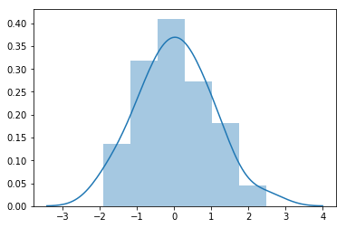
    


```python
# this is an iterable version, if you ever need it
def Rϕ(ndim=1, *, seed=0.5, mapper=identity):
    g = phi(ndim) 
    alpha = ((1/g)**np.arange(1, ndim+1))%1        
    z = np.ones(ndim)*seed
    while True:
        yield mapper(z)
        z = (z+alpha) %1 
```


```python
N = 100_000
x_r = a_generate(1, N, mapper=gaussian_icdf)
x_g = plt.randn(N)

n = np.arange(1, len(x_r)+1)
res_r = np.cumsum(x_r)/n
res_g = np.cumsum(x_g)/n

r = 10
plt.plot(n[r:], abs(res_r)[r:])
plt.plot(n[r:], abs(res_g)[r:])
plt.loglog()
```


    []


    
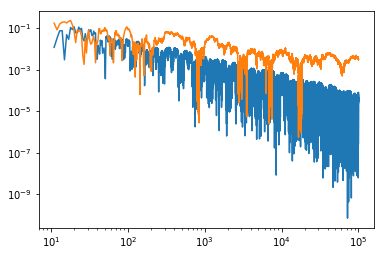
    


```python
b0 = a_generate(1, 1000, mapper=st.norm(loc=3, scale=0.1).isf)
sns.distplot(b0)
```


    <matplotlib.axes._subplots.AxesSubplot at 0x7faea086d518>


    
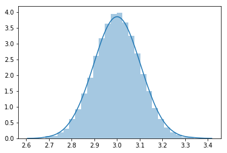
    


# Basic ODE integration

we can solve the cauchy problem using *scipy* **odeint** function.

this function needs:
* a function that describe the derivative of the system
* the starting state of the system
* the time points over which to integrate
* parameters describing the differential equation, that will be routed to the derivative function


```python
from scipy.integrate import odeint
```


```python
# derivative
def logistic(state, time, α, β):
    N = state
    δN = α*N - β*N**2
    return δN

# time steps
time = np.linspace(0, 1, 2**7+1)

# starting status
N0 = 0.1

# parameters
α = 10
β = 1
```

we use a base 2 based split for the time scales, to try and save some numerical precision


```python
np.linspace(0, 1, 2**3+1)
```


    array([0.   , 0.125, 0.25 , 0.375, 0.5  , 0.625, 0.75 , 0.875, 1.   ])


```python
res = odeint(logistic, y0=N0, t=time, args=(α, β))
```


```python
res.shape
```


    (129, 1)


```python
sns.despine?
```


```python
fig, ax = plt.subplots()
ax.plot(time, res, label="population")
ax.set_xlabel("time (a.u.)")
ax.set_ylabel("population (a.u.)")
ax.axhline(α/β, label='carrying capacity', color='gray', linewidth=3, linestyle='--')
ax.legend()
sns.despine(fig, trim=True, bottom=True, left=True)
```


    
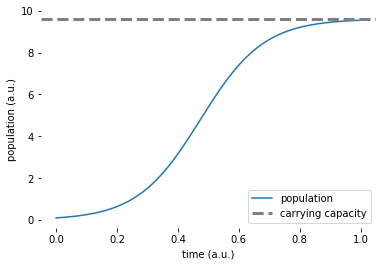
    


a convenient function is to transform the result of the integration in a pandas dataframe.

this allows us to use it for better visualization using seaborn


```python
def to_df(result, columns, **other_info):
    res_df = pd.DataFrame(result, columns=columns)
    for key, value in other_info.items():
        res_df[key] = value
    return res_df
```


```python
to_df(res, ['population'], α=α, β=β, time=time).head()
```


<div>
<style scoped>
    .dataframe tbody tr th:only-of-type {
        vertical-align: middle;
    }

    .dataframe tbody tr th {
        vertical-align: top;
    }

    .dataframe thead th {
        text-align: right;
    }
</style>
<table border="1" class="dataframe">
  <thead>
    <tr style="text-align: right;">
      <th></th>
      <th>population</th>
      <th>α</th>
      <th>β</th>
      <th>time</th>
    </tr>
  </thead>
  <tbody>
    <tr>
      <th>0</th>
      <td>0.100000</td>
      <td>10</td>
      <td>1</td>
      <td>0.000000</td>
    </tr>
    <tr>
      <th>1</th>
      <td>0.108038</td>
      <td>10</td>
      <td>1</td>
      <td>0.007812</td>
    </tr>
    <tr>
      <th>2</th>
      <td>0.116714</td>
      <td>10</td>
      <td>1</td>
      <td>0.015625</td>
    </tr>
    <tr>
      <th>3</th>
      <td>0.126079</td>
      <td>10</td>
      <td>1</td>
      <td>0.023438</td>
    </tr>
    <tr>
      <th>4</th>
      <td>0.136184</td>
      <td>10</td>
      <td>1</td>
      <td>0.031250</td>
    </tr>
  </tbody>
</table>
</div>


```python
# randomly generate alpha values
mapper = st.norm(loc=[10], scale=0.5).isf
# 50 values around the average value
alphas = a_generate(1, 50, mapper=mapper)
β = 1

time = np.linspace(0, 1, 2**7+1)

results = []
for idx, (α, ) in enumerate(alphas):
    res = odeint(logistic, y0=N0, t=time, args=(α, β))
    res_df = to_df(res, ['population'], α=α, β=β, time=time, simulation_run=idx)
    results.append(res_df)
results = pd.concat(results)
```


```python
sns.lineplot("time", 'population', data=results, hue='α',
             estimator=None, units='simulation_run')
```


    <matplotlib.axes._subplots.AxesSubplot at 0x7faea230aa58>


    
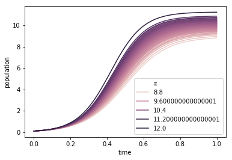
    


```python
#randomly generate beta values
mapper = st.norm(loc=[1], scale=0.05).isf
# 50 values around the average value
α = 10
betas = a_generate(1, 50, mapper=mapper)

time = np.linspace(0, 1, 2**7+1)

results = []
for idx, (β, ) in enumerate(betas):
    res = odeint(logistic, y0=N0, t=time, args=(α, β))
    res_df = to_df(res, ['population'], α=α, β=β, time=time, simulation_run=idx)
    results.append(res_df)
results = pd.concat(results)
```


```python
sns.lineplot("time", 'population', data=results, hue='β',
             estimator=None, units='simulation_run')
```


    <matplotlib.axes._subplots.AxesSubplot at 0x7fae9f70e828>


    
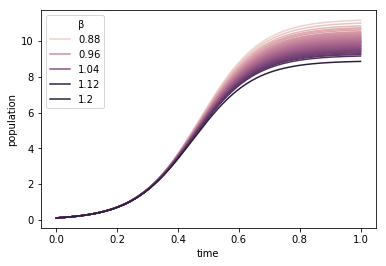
    


```python
# derivative
def logistic_bis(state, time, α, β):
    N = state
    δN = α*N - β*N**2
    δN = α*N*(1-N/β)
    return δN
```


```python
mapper = st.norm(loc=[10], scale=0.5).isf
# 50 values around the average value
alphas = a_generate(1, 50, mapper=mapper)
β = 1

time = np.linspace(0, 1, 2**7+1)

results = []
for idx, (α, ) in enumerate(alphas):
    res = odeint(logistic_bis, y0=N0, t=time, args=(α, β))
    res_df = to_df(res, ['population'], α=α, β=β, time=time, simulation_run=idx)
    results.append(res_df)
results = pd.concat(results)
```


```python
sns.lineplot("time", 'population', data=results, hue='α',
             estimator=None, units='simulation_run')
```


    <matplotlib.axes._subplots.AxesSubplot at 0x7fae9f6fd208>


    

    


```python
mapper = st.norm(loc=[1], scale=0.05).isf
# 50 values around the average value
α = 10
betas = a_generate(1, 50, mapper=mapper)

time = np.linspace(0, 1, 2**7+1)

results = []
for idx, (β, ) in enumerate(betas):
    res = odeint(logistic_bis, y0=N0, t=time, args=(α, β))
    res_df = to_df(res, ['population'], α=α, β=β, time=time, simulation_run=idx)
    results.append(res_df)
results = pd.concat(results)
```


```python
sns.lineplot("time", 'population', data=results, hue='β',
             estimator=None, units='simulation_run')
```


    <matplotlib.axes._subplots.AxesSubplot at 0x7fae9f3f76d8>


    
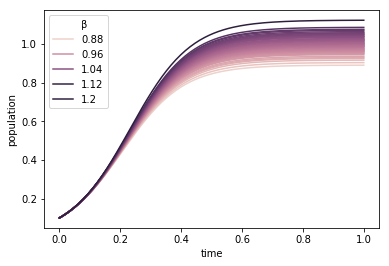
    


# SIR model

this is a classical model of the evolution of a disease in a population.

we start with the following variables:

* **S** susceptible, healthy subjects that can be infected
* **I** infected subjects, able to infect susceptible if they meet
* **R** resistant, subjects that have survived the illness and can not be infected again
* **D** deceased, subjects that did not survive the infection

there is one non linear interaction, due to the chance encounter between susceptible and infected.

The easiest way to model this is with a simple product of the two.

We will represent all the populations using normalized concentrations


```python
def SIR_model(state, time, α, β, γ):
    S, I, R, D = state
    δR = + α*I
    δD = + γ*I
    δI = - γ*I - α*I + β*I*S
    δS = - β*I*S
    return δS, δI, δR, δD 
    
time = np.linspace(0, 5, 2**9+1)
state0 = (1.0, 0.001, 0.0, 0.0)
α, β, γ = 1, 10, 0.3

res = odeint(SIR_model, y0=state0, t=time, args=(α, β, γ))
```


```python
S_hat, I_hat, R_hat, D_hat = res.T
```


```python
plt.plot(time, S_hat, label='S')
plt.plot(time, I_hat, label='I')
plt.plot(time, R_hat, label='R')
plt.plot(time, D_hat, label='D')

plt.legend()
```


    <matplotlib.legend.Legend at 0x7fae9f11c208>


    
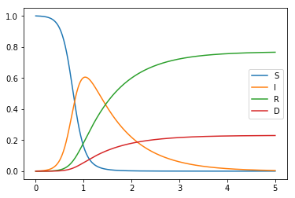
    


What happens if we change the value of one of the parameters?


```python
Nexp = 50
results = []
state0 = (1.0, 0.001, 0.0, 0.0)
α, β, γ = 1.0, 10.0, 0.3
α_seq = a_generate(1, Nexp, mapper=st.norm(loc=[1], scale=0.1).isf)

cols = ['S', 'I', 'R', 'D']
for idx, (α, ) in enumerate(α_seq):
    res = odeint(SIR_model, y0=state0, t=time, args=(α, β, γ))
    res_df = to_df(res, cols, N0=N0, α=α, β=β, γ=γ, time=time, simulation_run=idx, type='varying a')
    results.append(res_df)
results = pd.concat(results, ignore_index=True)
```


```python
alpha = 0.25
args = dict(data=results, estimator=None, units='simulation_run', alpha=alpha, hue='α', legend=False)
sns.lineplot("time", 'S', **args)
sns.lineplot("time", 'I', **args)
sns.lineplot("time", 'R', **args)
sns.lineplot("time", 'D', **args)

```


    <matplotlib.axes._subplots.AxesSubplot at 0x7fae9ed60588>


    

    


we can observe what difference does it makes if we let each parameter fluctuate one at the time, while fixing the others


```python
Nexp = 50
results = []
state0 = (1.0, 0.001, 0.0, 0.0)

α, β, γ = 1.0, 10.0, 0.3
α_seq = a_generate(1, Nexp, mapper=st.norm(loc=[α], scale=α*0.1).isf)
for idx, (α, ) in enumerate(α_seq):
    res = odeint(SIR_model, y0=state0, t=time, args=(α, β, γ))
    res_df = to_df(res, cols, N0=N0, α=α, β=β, γ=γ, 
                   time=time, simulation_run=idx, type='varying α')
    results.append(res_df)

α, β, γ = 1.0, 10.0, 0.3
β_seq = a_generate(1, Nexp, mapper=st.norm(loc=[β], scale=β*0.1).isf)
for idx, (β, ) in enumerate(β_seq):
    res = odeint(SIR_model, y0=state0, t=time, args=(α, β, γ))
    res_df = to_df(res, cols, N0=N0, α=α, β=β, γ=γ, 
                   time=time, simulation_run=idx, type='varying β')
    results.append(res_df)

α, β, γ = 1.0, 10.0, 0.3
γ_seq = a_generate(1, Nexp, mapper=st.norm(loc=[γ], scale=γ*0.1).isf)
for idx, (γ, ) in enumerate(γ_seq):
    res = odeint(SIR_model, y0=state0, t=time, args=(α, β, γ))
    res_df = to_df(res, cols, N0=N0, α=α, β=β, γ=γ, 
                   time=time, simulation_run=idx, type='varying γ')
    results.append(res_df)
results = pd.concat(results, ignore_index=True)
```


```python
fg = sns.FacetGrid(data=results, col='type', height=6)
fg.map_dataframe(sns.lineplot, "time", 'S', estimator=None, units='simulation_run', alpha=alpha, color='r')
fg.map_dataframe(sns.lineplot, "time", 'I', estimator=None, units='simulation_run', alpha=alpha, color='b')
fg.map_dataframe(sns.lineplot, "time", 'R', estimator=None, units='simulation_run', alpha=alpha, color='g')
fg.map_dataframe(sns.lineplot, "time", 'D', estimator=None, units='simulation_run', alpha=alpha, color='orange')
sns.despine(fg.fig, trim=True)
```


    

    


To have a better understanding, we could also use a subset of the phase space, to see how different variables change over time


```python
fg = sns.FacetGrid(data=results, col='type', height=6)
fg.map_dataframe(sns.lineplot, "S", 'I', estimator=None, units='simulation_run', alpha=alpha, color='r')
fg.map_dataframe(sns.lineplot, "S", 'R', estimator=None, units='simulation_run', alpha=alpha, color='b')
fg.map_dataframe(sns.lineplot, "S", 'D', estimator=None, units='simulation_run', alpha=alpha, color='g')
sns.despine(fg.fig, trim=True)
```


    

    


```python
fg = sns.FacetGrid(data=results, col='type', height=6)
fg.map_dataframe(sns.lineplot, "R", 'S', estimator=None, units='simulation_run', alpha=alpha, color='r')
fg.map_dataframe(sns.lineplot, "R", 'I', estimator=None, units='simulation_run', alpha=alpha, color='g')
fg.map_dataframe(sns.lineplot, "R", 'D', estimator=None, units='simulation_run', alpha=alpha, color='orange')
sns.despine(fg.fig, trim=True)
```


    

    


To have a better understanding of the be behavior of the system, we could also fix a parameter and let the others change randomly.

By observing the resulting variance point by point we can infer the relevance of each parameter.

This is the basic approach for the global sensitivity analysis as used by Saltelli at al., and is the implementation basis of the SALib we saw last lesson.

# sampling with noise

a different approach to sensitity analysis is to try and generate random samples that replicate a possible measurement and try to fit the ODE parameters and observe how they change and covariate


```python
scale = 100

time = np.linspace(0, 5, 2**5+1)
state0 = (1.0, 0.001, 0.0, 0.0)
α, β, γ = 1, 10, 0.3
res = odeint(SIR_model, y0=state0, t=time, args=(α, β, γ))
S_hat, I_hat, R_hat, D_hat = res.T
```


```python
plt.plot(time, S_hat, label='S')
plt.plot(time, I_hat, label='I')
plt.plot(time, R_hat, label='R')
plt.plot(time, D_hat, label='D')

plt.legend()
```


    <matplotlib.legend.Legend at 0x7faea0627198>


    

    


the easiest way to do this is to use gaussian noise


```python
S_hat_normal, I_hat_normal, R_hat_normal, D_hat_normal = st.norm.rvs(loc=res*scale, scale=0.1*scale).T

plt.plot(time, S_hat*scale, label='S')
plt.plot(time, I_hat*scale, label='I')
plt.plot(time, R_hat*scale, label='R')
plt.plot(time, D_hat*scale, label='D')

plt.scatter(time, S_hat_normal)
plt.scatter(time, I_hat_normal)
plt.scatter(time, R_hat_normal)
plt.scatter(time, D_hat_normal)

plt.legend()
```


    <matplotlib.legend.Legend at 0x7faea2f327f0>


    

    


this clearly have problems, such as the population appearing negative!

we would be better using a different sampling such as the poisson distribution


```python
st.poisson.rvs(res*scale)
```


    array([[ 90,   0,   0,   0],
           [ 93,   0,   0,   0],
           [ 99,   2,   0,   0],
           [104,   3,   1,   1],
           [ 79,  13,   1,   0],
           [ 63,  40,   6,   1],
           [ 25,  57,   9,   2],
           [  7,  69,  27,   4],
           [  4,  52,  28,   9],
           [  2,  48,  34,  10],
           [  0,  36,  62,  15],
           [  1,  42,  55,  23],
           [  0,  20,  59,  20],
           [  0,  15,  53,  13],
           [  1,  22,  66,  19],
           [  0,   8,  69,  18],
           [  0,   8,  92,  21],
           [  0,   5,  83,  24],
           [  0,   3,  71,  18],
           [  0,   5,  65,  23],
           [  0,   6,  72,  20],
           [  0,   4,  63,  14],
           [  0,   6,  58,  17],
           [  0,   1,  66,  26],
           [  0,   6,  68,  24],
           [  0,   2,  78,  33],
           [  0,   1,  69,  16],
           [  0,   1,  68,  22],
           [  0,   1,  83,  15],
           [  0,   1,  92,  17],
           [  1,   0,  66,  24],
           [  0,   0,  88,  23],
           [  0,   1,  82,  26]])


```python
S_hat_poisson, I_hat_poisson, R_hat_poisson, D_hat_poisson = st.poisson.rvs(res*scale).T

plt.plot(time, S_hat*scale, label='S')
plt.plot(time, I_hat*scale, label='I')
plt.plot(time, R_hat*scale, label='R')
plt.plot(time, D_hat*scale, label='D')

plt.scatter(time, S_hat_poisson)
plt.scatter(time, I_hat_poisson)
plt.scatter(time, R_hat_poisson)
plt.scatter(time, D_hat_poisson)

plt.legend()
```


    <matplotlib.legend.Legend at 0x7faea34f1c50>


    
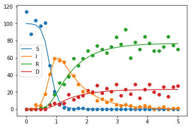
    


# fitting

now for the fitting procedure itself.

in a similar way to odeint, we will use a curve_fit function that will give use an estimate of the parameters and their correlations.

to do this, it takes a function that, given the x values and a set of parameters, it gives the prediction.


```python
from scipy.optimize import curve_fit
# ydata = f(xdata, *params) + eps
```

let's study it with a linear regression first


```python
x = plt.randn(30)
y = 2*x + 3 + plt.randn(30)*0.8
plt.scatter(x, y)
```


    <matplotlib.collections.PathCollection at 0x7faea1307d30>


    

    


```python
def linear_fit(xdata, m, q):
    return m*xdata + q

p_avg, p_cov = curve_fit(linear_fit, x, y, p0=[1, 0])
```


```python
x_base = np.linspace(-2, 2, 51)
y_hat = linear_fit(x_base, *p_avg)
plt.scatter(x, y)
plt.plot(x_base, y_hat)
```


    [<matplotlib.lines.Line2D at 0x7fae9e169160>]


    
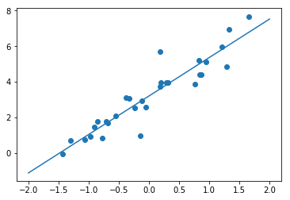
    


## how to visualize uncertainty?

se use the normal sampling we used before!

we just need to implement a more refined mapper to include the effect of the covariance


```python
class mapper_multivariate_normal:
    def __init__(self, mean, cov):
        self.mean = mean
        self.cov = cov
        # we have to use the cholesky decomposition to generate the samples
        self.L = np.linalg.cholesky(cov)
        
    def __call__(self, quantiles):
        values_standard = st.norm.isf(quantiles)
        values =  self.L @ values_standard.reshape(len(self.L), -1)
        values = values + self.mean.reshape(len(self.L), -1)
        return values.T
```


```python
mapper = mapper_multivariate_normal(mean=p_avg, cov=p_cov)
p_seq = a_generate(2, 2000, mapper=mapper)
```


```python
p_seq.shape
```


    (2000, 2)


```python
p_avg
```


    array([2.15866617, 3.2044176 ])


```python
np.mean(p_seq, axis=0)
```


    array([2.15848794, 3.20431769])


```python
p_cov
```


    array([[ 0.02514466, -0.00033348],
           [-0.00033348,  0.01776468]])


```python
np.cov(p_seq.T)
```


    array([[0.02511267, 0.00269974],
           [0.00269974, 0.01767856]])


```python
plt.scatter(x, y)

mapper = mapper_multivariate_normal(mean=p_avg, cov=p_cov)
p_seq = a_generate(2, 50, mapper=mapper)
x_base = np.linspace(-2, 2, 51)
y_hat = linear_fit(x_base, *p_avg)
plt.plot(x_base, y_hat)

for params in p_seq:
    y_hat = linear_fit(x_base, *params)
    plt.plot(x_base, y_hat, color='teal', alpha=0.05)
```


    
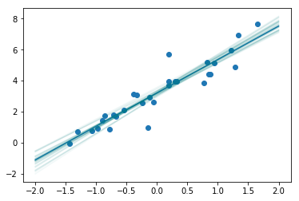
    


if one does not have access to a low discrepancy sequence, it might use just normal random generation, but will be limited in the precision that they can obtain


```python
plt.scatter(x, y)

p_seq = st.multivariate_normal.rvs(mean=p_avg, cov=p_cov, size=50)
x_base = np.linspace(-2, 2, 51)
y_hat = linear_fit(x_base, *p_avg)
plt.plot(x_base, y_hat)

for params in p_seq:
    y_hat = linear_fit(x_base, *params)
    plt.plot(x_base, y_hat, color='teal', alpha=0.05)
```


    

    


a better visualization can be done using the 95% quantiles representation


```python
from scipy.stats.mstats import mquantiles
```


```python
plt.scatter(x, y)

p_seq = st.multivariate_normal.rvs(mean=p_avg, cov=p_cov, size=50)
x_base = np.linspace(-2, 2, 101)
y_hat = linear_fit(x_base, *p_avg)
plt.plot(x_base, y_hat)
y_hat = [linear_fit(x_base, *params) for params in p_seq]
y_hat = np.stack(y_hat)

p_low, p_top = mquantiles(y_hat, prob=[0.025, 0.975], axis=0)
plt.fill_between(x_base, p_low, p_top, alpha=0.1, color='teal')
```


    <matplotlib.collections.PolyCollection at 0x7fae9fa2e0b8>


    
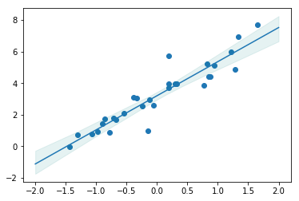
    


# what about differential equations?

to keep it simple we will use a simpler differential equation, the harmonic oscillator


```python
def harmonic(state, time, α, β):
    x, v = state
    return α*v, -β*x

time = np.linspace(0, 10, 2**5)
y0 = (0, 1)
res = odeint(harmonic, y0=y0, t=time, args=(1, 1))
X, V = res.T
plt.plot(time, X)
plt.plot(time, V)
```


    [<matplotlib.lines.Line2D at 0x7fae9f24b8d0>]


    

    


```python
res_obs = res+plt.randn(*res.shape)*0.2
X_obs, V_obs = res_obs.T
plt.plot(time, X)
plt.plot(time, V)
plt.scatter(time, X_obs)
plt.scatter(time, V_obs)
```


    <matplotlib.collections.PathCollection at 0x7fae9f63f048>


    
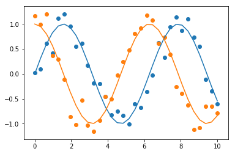
    


to use in the fit, one just nesds to generate the data from the differential equation inside the function to be given to the fit function.

They only caveat is that we have un unravel the array so that it only has one dimension


```python
def harmonic_fit(xdata, α, β):
    time = np.linspace(0, 5, 2**5)
    y0 = (0, 1)
    res = odeint(harmonic, y0=y0, t=xdata, args=(α, β))
    return res.ravel()

p_avg, p_cov = curve_fit(harmonic_fit, time, res_obs.ravel(), 
                         p0=[0.9, 1.1]) # try 0.5, 0.5
```


```python
p_avg
```


    array([0.97175808, 1.04626364])


```python
p_cov
```


    array([[ 0.00281177, -0.00295355],
           [-0.00295355,  0.0032701 ]])


```python
plt.scatter(xdata, ydata)

mapper = mapper_multivariate_normal(mean=p_avg, cov=p_cov)
p_seq = a_generate(2, 50, mapper=mapper)
x_base = np.linspace(0, 10, 51)

for params in p_seq:
    y_hat = harmonic_fit(x_base, *params).reshape(-1, 2)
    plt.plot(x_base, y_hat, color='teal', alpha=0.2)
    
y_hat = harmonic_fit(x_base, *p_avg).reshape(-1, 2)
plt.plot(x_base, y_hat, color='r')
```


    [<matplotlib.lines.Line2D at 0x7fae9f9ae7f0>,
     <matplotlib.lines.Line2D at 0x7fae9fa67ac8>]


    

    


```python
plt.scatter(xdata, ydata)

Nexp = 50

mapper = mapper_multivariate_normal(mean=p_avg, cov=p_cov)
p_seq = a_generate(2, 50, mapper=mapper)
x_base = np.linspace(0, 10, 101)
y_hat = harmonic_fit(x_base, *p_avg)
plt.plot(x_base, y_hat.reshape(-1, 2))
y_hat = [harmonic_fit(x_base, *params).reshape(-1, 2) for params in p_seq]
y_hat = np.stack(y_hat)

y_hat_x = y_hat[:, :, 0]
y_hat_v = y_hat[:, :, 1]

p_low_x, p_top_x = mquantiles(y_hat_x, prob=[0.025, 0.975], axis=0)
p_low_v, p_top_v = mquantiles(y_hat_v, prob=[0.025, 0.975], axis=0)

plt.fill_between(x_base, p_low_x, p_top_x, alpha=0.5, color='teal')
plt.fill_between(x_base, p_low_v, p_top_v, alpha=0.5, color='orange')

#plt.plot(x_base, y_hat_x.T, alpha=0.1, color='b');
```


    <matplotlib.collections.PolyCollection at 0x7fae9f3a2eb8>


    

    


```python
p_seq = st.multivariate_normal.rvs(mean=p_avg, cov=p_cov, size=Nexp)
print(np.mean(p_seq,axis=0))
print(p_avg)
print(np.cov(p_seq.T))
print(p_cov)
```

    [0.96700595 1.05223848]
    [0.97175808 1.04626364]
    [[ 0.00325726 -0.00338544]
     [-0.00338544  0.00365905]]
    [[ 0.00281177 -0.00295355]
     [-0.00295355  0.0032701 ]]


```python
mapper = mapper_multivariate_normal(mean=p_avg, cov=p_cov)
p_seq = a_generate(2, 2000, mapper=mapper)
print(np.mean(p_seq, axis=0))
print(p_avg)
print(np.cov(p_seq.T))
print(p_cov)
```

    [0.97169848 1.04631631]
    [0.97175808 1.04626364]
    [[ 0.0028082  -0.00285127]
     [-0.00285127  0.00305911]]
    [[ 0.00281177 -0.00295355]
     [-0.00295355  0.0032701 ]]

