# Random Sampling and distance-based Statistics

# Resampling

estimating statistics using random samples.

let's consider the idea of p-value:

given a test statistics from the observed data and a null hypothesis (a generation process), what are the chances of osberving a value greater than the one obtained on the data if the data was generated from the null hypothesis?

## the t-test statistics

the simplest example is the one-sample t-test:
 is the observed mean of a sample compatible with 0?


```python
import numpy as np
import pylab as plt
import scipy.stats as st
import seaborn as sns
```


```python
data_1 = np.array([1.35, 1.01, 0.25, 0.39, -1.57])
st.ttest_1samp(data_1, 0)
```


    Ttest_1sampResult(statistic=0.5656372970687832, pvalue=0.6018616929196308)


in this case the statistic is defined as the mean divided the standard deviation of the mean:

$$t = \frac{Z}{s} = \frac{\bar{X} – \mu}{\frac{\hat{\sigma}}{\sqrt{n}}}$$


```python
mean_1 = np.mean(data_1)
std_1 = np.std(data_1, ddof=1)
print(mean_1, std_1, mean_1/(std_1/np.sqrt(len(data_1))))
```

    0.2860000000000001 1.130610454577526 0.5656372970687832


```python
np.mean(data_1)/st.sem(data_1)
```


    0.5656372970687832


```python
def t_stat(data):
    return np.mean(data)/st.sem(data)
```


```python
n_data = len(data_1)
data_fake_1 = plt.randn(n_data)
t_stat(data_fake_1)
```


    0.11223874999398128


```python
distribution = [t_stat(plt.randn(n_data)) for i in range(100_000)]
```


```python
fig, ax = plt.subplots()
ax.hist(distribution, bins=50, alpha=0.5, color='teal')
ax.axvline(t_stat(data_1), color='coral')
ax.set_xlim(-5, 5)
```


    (-5.0, 5.0)


    
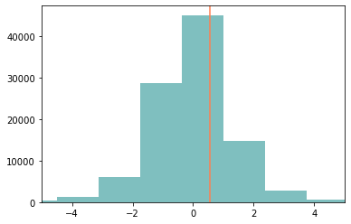
    


```python
greater = np.abs(np.array(distribution))>abs(t_stat(data_1))
p_value = sum(greater)/len(greater)
print(p_value)
```

    0.6023


```python
st.ttest_1samp(data_1, 0)
```


    Ttest_1sampResult(statistic=0.5656372970687832, pvalue=0.6018616929196308)


this can be applied in a more general sense: given any statistical generative procedure, what is the chance of observing values more extreme than the given ones?

## correcting for the "real" process

for example, in this case we should have included the truncation procedure in out data! (we only have two decimal digits).


```python
def gen_fake(n):
    fake_data = plt.randn(n)
    return fake_data.round(2)
gen_fake(5)
```


    array([-0.33,  0.52, -0.65, -1.32, -0.38])


```python
distribution = [t_stat(gen_fake(n_data)) for i in range(100_000)]
```


```python
greater = np.abs(np.array(distribution))>abs(t_stat(data_1))
p_value = sum(greater)/len(greater)
print(p_value)
```

    0.59904


of course, we could also perform several generation to have an estimate of our uncertainty in the p-value


```python
for i in range(8):
    distribution = [t_stat(gen_fake(n_data)) for i in range(1_000)]
    greater = np.abs(np.array(distribution))>abs(t_stat(data_1))
    p_value = sum(greater)/len(greater)
    print(p_value)
```

    0.591
    0.605
    0.614
    0.604
    0.599
    0.609
    0.631
    0.609


# Perfect Sampling (Bayesian statistics)

http://www.sumsar.net/blog/2014/10/tiny-data-and-the-socks-of-karl-broman/

a similar procedure can the used to perform bayesian inference, in particular for simple models:

1. extract from the prior distribution of the parameters
2. generate some random data with those parameters
3. if the data are similar enough to the observed data (or equal) keep those parameters
4. repeat until enough parameters are observed

This class of methods allow us to answer more complex questions naturally!

NOTE: as far as I know, there is no particular advantage is using low discrepancy sequences here, the randomness compound too much

**experiment**:

we observe a biased coin with 7 heads and 3 tails.

what is the probability of the coin coming out with tail the next toss?

from formal analysis, we can derive the distribution as ${Beta}(7+\alpha, 3+\beta)$

where $\alpha$ and $\beta$ are the prior parameters (already known information)


```python
def plot_beta(dist, ax=None, base=np.linspace(0, 1, 10_000), **kwargs):
    if ax is None:
        ax=plt.gca()
    pdf = dist.pdf(base)
    kwargs.setdefault("alpha", 0.5)
    ax.fill_between(base, pdf, 0, **kwargs)
```


```python
α, β = 1, 1
prior = st.beta(α, β)
plot_beta(prior)
```


    
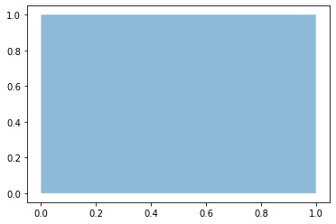
    


```python
α, β = 1, 1
true_posterior = st.beta(7+α, 3+β)
plot_beta(true_posterior)
```


    
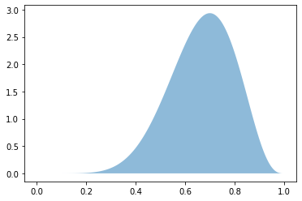
    


```python
np.random.seed(42)
N_samples = 10
sampled_prior = prior.rvs(N_samples)
print(sampled_prior)
```

    [0.52232255 0.49999941 0.5272587  0.46421572 0.57900808 0.45226229
     0.55805831 0.47652842 0.48880595 0.53794006]


```python
st.binom.rvs(n=10, p=sampled_prior)
```


    array([6, 6, 6, 5, 6, 3, 3, 6, 7, 3])


```python
fake_observations = st.binom.rvs(n=10, p=sampled_prior)
```


```python
observed = 7
coherent = (fake_observations==7)
selected_prior = sampled_prior[coherent]
print(len(selected_prior))
```

    2


```python
observed = 7
N_samples = 100
sampled_prior = prior.rvs(N_samples)
fake_observations = st.binom.rvs(n=10, p=sampled_prior)
coherent = (fake_observations==7)
selected_prior = sampled_prior[coherent]
print(len(selected_prior))
```

    12


```python
plt.hist(selected_prior, bins=50, density=True, alpha=0.5, color="coral");
plot_beta(true_posterior, color='teal')
```


    
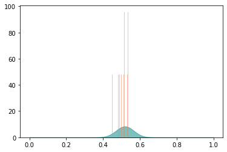
    


```python
%%time
observed = 7
N_samples = 100_000
sampled_prior = prior.rvs(N_samples)
fake_observations = st.binom.rvs(n=10, p=sampled_prior)
coherent = (fake_observations==observed)
selected_prior = sampled_prior[coherent]
n_accepted = len(selected_prior)
s = "accepted samples: {}\nacceptance fraction: {}%\n-----"
print(s.format(n_accepted, 100*n_accepted/N_samples))
```

    accepted samples: 12234
    acceptance fraction: 12.234%
    -----
    CPU times: user 55.5 ms, sys: 0 ns, total: 55.5 ms
    Wall time: 56.1 ms


```python
plt.hist(selected_prior, bins=50, density=True, alpha=0.5, color="coral");
plot_beta(true_posterior, color='teal')
```


    
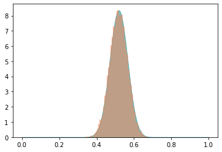
    


# how do different priors affect me?

with this approach I can model how the belief on the possible values of the parameters could affect my final result


```python
def fit_probability(successes=7, failures=3, α=1, β=1, N_samples=100_000):
    prior = st.beta(α, β)
    true_posterior = st.beta(successes+α, failures+β)
    sampled_prior = prior.rvs(N_samples)
    n_observations = successes+failures
    fake_observations = st.binom.rvs(n=n_observations, p=sampled_prior)
    coherent = (fake_observations==successes)
    selected_prior = sampled_prior[coherent]
    return prior, true_posterior, selected_prior
```


```python
result = fit_probability(successes=7, failures=3, α=0.5, β=0.5, N_samples=100_000)
prior, true_posterior, selected_prior = result
n_accepted = len(selected_prior)
s = "accepted samples: {}\nacceptance fraction: {}%\n-----"
print(s.format(n_accepted, 100*n_accepted/N_samples))
plt.hist(selected_prior, bins=50, density=True, alpha=0.5, color="coral");
plot_beta(true_posterior, color='teal')
plot_beta(prior, color='violet')
plot_beta(st.beta(1+7, 1+3), color='orange', alpha=0.25)
```

    accepted samples: 6661
    acceptance fraction: 6.661%
    -----


    
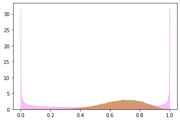
    


```python
result = fit_probability(successes=7, failures=3, α=1, β=1, N_samples=100_000)
prior, true_posterior, selected_prior = result
n_accepted = len(selected_prior)
s = "accepted samples: {}\nacceptance fraction: {}%\n-----"
print(s.format(n_accepted, 100*n_accepted/N_samples))
plt.hist(selected_prior, bins=50, density=True, alpha=0.5, color="coral");
plot_beta(true_posterior, color='teal')
plot_beta(prior, color='violet')
plot_beta(st.beta(1+7, 1+3), color='orange', alpha=0.25)
```

    accepted samples: 9084
    acceptance fraction: 9.084%
    -----


    
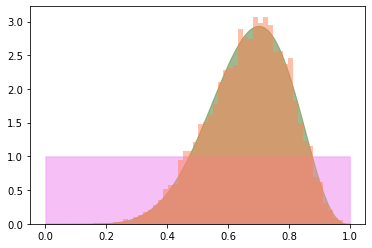
    


```python
result = fit_probability(successes=7, failures=3, α=5, β=5, N_samples=100_000)
prior, true_posterior, selected_prior = result
n_accepted = len(selected_prior)
s = "accepted samples: {}\nacceptance fraction: {}%\n-----"
print(s.format(n_accepted, 100*n_accepted/N_samples))
plt.hist(selected_prior, bins=50, density=True, alpha=0.5, color="coral");
plot_beta(true_posterior, color='teal')
plot_beta(prior, color='violet')
plot_beta(st.beta(1+7, 1+3), color='orange', alpha=0.25)
```

    accepted samples: 12391
    acceptance fraction: 12.391%
    -----


    
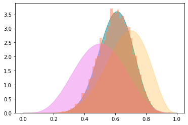
    


```python
result = fit_probability(successes=7, failures=3, α=50, β=50, N_samples=100_000)
prior, true_posterior, selected_prior = result
n_accepted = len(selected_prior)
s = "accepted samples: {}\nacceptance fraction: {}%\n-----"
print(s.format(n_accepted, 100*n_accepted/N_samples))
plt.hist(selected_prior, bins=50, density=True, alpha=0.5, color="coral");
plot_beta(true_posterior, color='teal')
plot_beta(prior, color='violet')
plot_beta(st.beta(1+7, 1+3), color='orange', alpha=0.25)
```

    accepted samples: 11882
    acceptance fraction: 11.882%
    -----


    
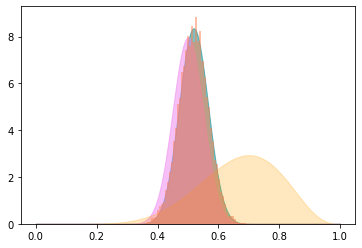
    


# discontinuous model

we could try to decide if the coin is biased or not, rather than estimating a probability

to do this, we need hyperparameters describing the set of models


```python
α_of_bias, β_of_bias = 1, 1
belief_coin_biased = 0.1

n_observations = 10
successes = 10

N_samples = 100_000

coin_is_biased_prior = st.binom(n=1, p=belief_coin_biased)
coin_is_biased_prior_samples = coin_is_biased_prior.rvs(N_samples).astype(bool)

p_coin_if_biased_prior = st.beta(α_of_bias, β_of_bias)
p_coin_if_biased_prior_samples = p_coin_if_biased_prior.rvs(N_samples)

p_coin_effective = np.where(coin_is_biased_prior_samples, p_coin_if_biased_prior_samples, 0.5)

fake_observations = st.binom.rvs(n=n_observations, p=p_coin_effective)
coherent = (fake_observations==successes)
p_coin_posterior = p_coin_effective[coherent]
p_coin_posterior_if_biased = p_coin_effective[coherent&coin_is_biased_prior_samples]
p_coin_is_biased_posterior = (coin_is_biased_prior_samples&coherent).sum()/coherent.sum()

print(coherent.sum())
print(len(p_coin_posterior_if_biased))
print(p_coin_is_biased_posterior)
```

    971
    890
    0.9165808444902163


```python
plt.hist(p_coin_posterior_if_biased, bins=50);
```


    
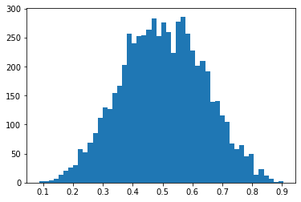
    


# What happens if we have multiple coins?


```python
np.random.seed(2)
observed = np.array([7, 8, 9])
n_trials = len(observed)

N_samples = 6
prior = st.beta(1, 1)
sampled_prior = prior.rvs(N_samples)
fake_observations = st.binom.rvs(n=10, p=sampled_prior, size=(n_trials, N_samples))
```


```python
fake_observations
```


    array([[10,  4,  4,  2,  4,  0],
           [10,  8,  6,  1,  7,  2],
           [10,  8,  7,  2,  5,  1]])


```python
fake_observations==observed.reshape(-1, 1)
```


    array([[False, False, False, False, False, False],
           [False,  True, False, False, False, False],
           [False, False, False, False, False, False]])


```python
(fake_observations==observed.reshape(-1, 1)).all(axis=0)
```


    array([False, False, False, False, False, False])


```python
np.random.seed(2)
observed = np.array([7, 8, 9])
n_trials = len(observed)

N_samples = 1_000_000
prior = st.beta(1, 1)
sampled_prior = prior.rvs(N_samples)
fake_observations = st.binom.rvs(n=10, p=sampled_prior, size=(n_trials, N_samples))
(fake_observations==observed.reshape(-1, 1)).all(axis=0).sum()
```


    2972


very low acceptance stops us from finding results

but we're being too bad with ourselves: we don't care about the ordering of the data, as it is completely arbitrary!

we might test the **sorted** data!


```python
np.random.seed(2)
observed = np.array([7, 8, 9])
n_trials = len(observed)

N_samples = 6
prior = st.beta(1, 1)
sampled_prior = prior.rvs(N_samples)
fake_observations = st.binom.rvs(n=10, p=sampled_prior, size=(n_trials, N_samples))
```


```python
fake_observations
```


    array([[10,  4,  4,  2,  4,  0],
           [10,  8,  6,  1,  7,  2],
           [10,  8,  7,  2,  5,  1]])


```python
np.sort(fake_observations, axis=0)
```


    array([[10,  4,  4,  1,  4,  0],
           [10,  8,  6,  2,  5,  1],
           [10,  8,  7,  2,  7,  2]])


```python
np.random.seed(2)
observed = np.array([7, 8, 9]).reshape(-1, 1)
n_trials = len(observed)

N_samples = 1_000_000
prior = st.beta(1, 1)
sampled_prior = prior.rvs(N_samples)
fake_observations = st.binom.rvs(n=10, p=sampled_prior, size=(n_trials, N_samples))

fake_observations = np.sort(fake_observations, axis=0)
observed = np.sort(observed, axis=0)

(fake_observations==observed).all(axis=0).sum()
```


    17555


```python
17555/2972
```


    5.906796769851952


we captured 6 times more cases!

this approach is extremely useful when there is some invariant in my data (for example permutations)

## sampling requirement limitations

a common problem of this approach is that increasing the number of data and the dimensionality (in particular if the prior is strongly different from the posterior), the number of sampling required is incredibly high.

on the upside, we can easily parallelize the computation, but it is often not enough.

in the extreme case of real valued parameters, the probability of exact sampling is exactly zero!

NOTE: for continuous values it is still formally possible to perform perfect sampling on real data, considering that the measurement procedure involves always a rounding/truncation procedure... 

formally the probabily is not 0 anymore, but it's still incredibly low unless the rounding is very strong

## distance based approach

to increase the sampling rate, with a (non trivial) reduction in the quality of the fit, one possibility is to use

#### Approximated Bayesian Computation

the idea is that we accept any data that is close enough, where "close" is defined over a set of measurements instead of the whole dataset.

examples could be: mean, standard deviation, rate, etc...

**IMPORTANT**: the result depends also on the chosen threshold!

if we are working in the exponential distribution family and use the natural parametrization, the result should be unbiased

## non likelihood-based approaches

One of the bis advantages of this approach is that one doesn't need to be able to define a likelihood function: if the data can be simulated in any way from the priors, we don't need anything else.

likelihood based models are exremely more efficient computation wise, but often are suffer from a **"specification problem"**: I can only model what I can represent with composition of simple distributions

one simple example can be shown with ODE.
They are not random, but it can still be used to perform a fit!


```python
from scipy.optimize import curve_fit
from scipy.integrate import odeint

# derivative
def logistic(state, time, α, β):
    N = state
    δN = α*N*(1-N/β)
    return δN

def logistic_predict(N0, α, β, time):
    res = odeint(logistic, y0=N0, t=time, args=(α, β))
    return res.ravel()

time = np.linspace(0, 5, 2**3)
N0, α, β = 1, 1, 10
original = logistic_predict(N0, α, β, time)
original
```


    array([1.        , 1.84983933, 3.16770552, 4.86411522, 6.59242029,
           7.98058516, 8.89779416, 9.42825654])


we could use as a distance the sum of the square of the differences


```python
N0_hat, α_hat, β_hat = 1.1, 1.1,9.9
sampled = logistic_predict(N0_hat, α_hat, β_hat, time)
sampled
```


    array([1.1       , 2.13070378, 3.7190289 , 5.63292789, 7.35909333,
           8.55384672, 9.23739986, 9.58657484])


```python
def dist(samp1, samp2):
    return np.sqrt(np.sum((samp1-samp2)**2))

dist(original, sampled)
```


    1.4285406231844497


let's try a threshold of one, with some simple priors


```python
def plot_dist(dist, ax=None, base=np.linspace(0, 20, 10_000), **kwargs):
    if ax is None:
        ax=plt.gca()
    pdf = dist.pdf(base)
    kwargs.setdefault("alpha", 0.5)
    ax.fill_between(base, pdf, 0, **kwargs)
```


```python
N0_prior = st.gamma(1, scale=1, loc=0)
α_prior = st.gamma(1, scale=1, loc=0)
β_prior = st.gamma(1, scale=10, loc=0)
```


```python
plot_dist(α_prior)
plot_dist(β_prior)
plot_dist(N0_prior)
```


    
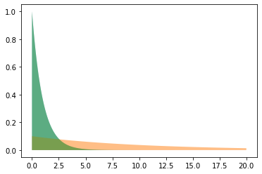
    


```python
N0_hat = N0_prior.rvs(1)
α_hat = α_prior.rvs(1)
β_hat = β_prior.rvs(1)
print(N0_hat, α_hat, β_hat)
sampled = logistic_predict(N0_hat, α_hat, β_hat, time)
print(sampled)
d = dist(original, sampled)
print(d)
```

    [2.33472184] [1.02405695] [8.98527664]
    [2.33472184 3.79010012 5.41414216 6.8204747  7.79476544 8.37011585
     8.67835905 8.83492298]
    4.051848820347763


```python
%%time
accepted = []
for i in range(100_000):
    N0_hat = N0_prior.rvs(1)
    α_hat = α_prior.rvs(1)
    β_hat = β_prior.rvs(1)
    sampled = logistic_predict(N0_hat, α_hat, β_hat, time)
    d = dist(original, sampled)
    if d<1:
        accepted.append([N0_hat, α_hat, β_hat])
accepted = np.array(accepted)
len(accepted)
```

    CPU times: user 3min 37s, sys: 1.94 s, total: 3min 39s
    Wall time: 3min 35s


    116


```python
fig, axes = plt.subplots(1, 3, figsize=(12, 4))
axes[0].hist(accepted[:, 0], density=True)
axes[1].hist(accepted[:, 1], density=True)
axes[2].hist(accepted[:, 2], density=True)
plot_dist(α_prior, ax=axes[1])
plot_dist(β_prior, ax=axes[2])
plot_dist(N0_prior, ax=axes[0])
axes[0].set_title("$N_0$ posterior")
axes[1].set_title("α posterior")
axes[2].set_title("β posterior")
fig.tight_layout()
```


    
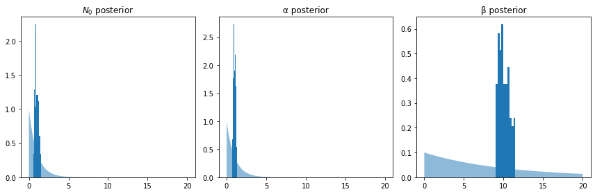
    


```python

```
