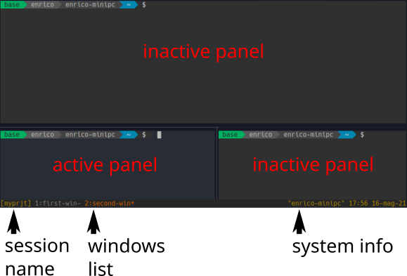
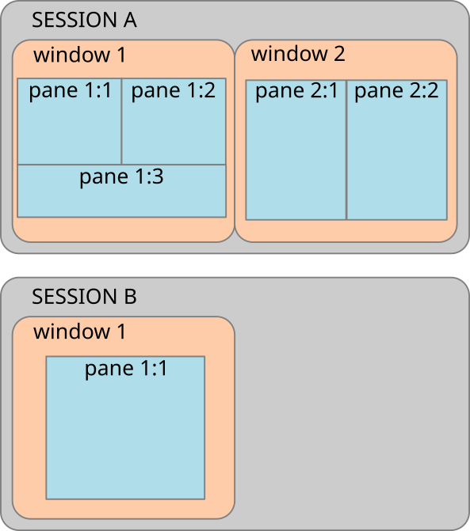
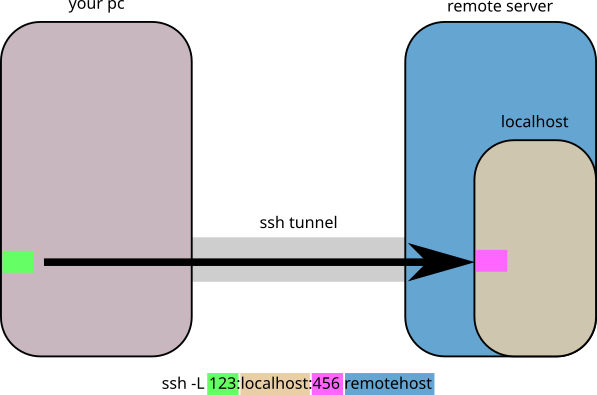
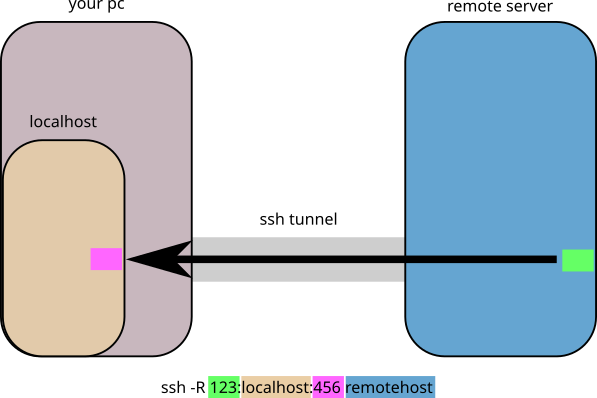
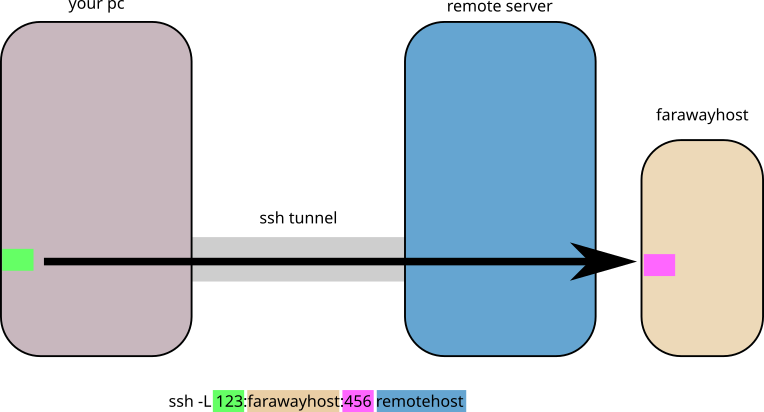
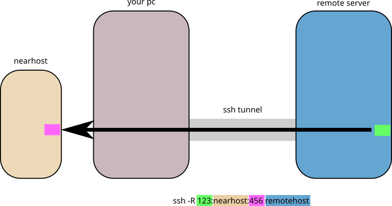

# Remote Server Management

## connecting and getting the most out of a remote server

## TMUX - terminal multiplexing

https://leanpub.com/the-tao-of-tmux/read

TMUX is a "window manager" for the terminal.

It is extremely useful to manage working sessions, especially on remote servers

### advantages

* allow to have multiple terminal opens, with rich split screen
* sessions persists between connections (can hold long running programs like a jupyter kernel)
* allow for multiuser collaboration

### the design - 1 

whenever you launch `tmux` it creates a session to which you can connect (*attach*) and disconnect (*detach*).

The manager will keep running until you explicitely kill it.

you can have multiple tmux sessions running at the same time.

I usually start a new tmux session for every project that I start.

There are also several ways to configure tmux to have pre-configured sessions (**tmuxinator**, **tmux-resurrect**, etc...)

All the controls given to tmux will be provided using a **leader key**.

By default is set to `Ctrl-b`, but you can change it by editing the `~/.tmux.conf` file with:

```
set -g prefix C-Space
```

I prefere using `Ctrl-space` or `Ctrl-a` (when `CAPSLOCK` is remapped to `Ctrl`)

after using the **leader** one can provide another keybinding for a command or type `:` and spell it out

at any point you can use `leader-?` to see all keybinding or `leader-:list-commands` to see all the available commands (goes back to the session pressing `q` or `Return`)



### session management - the basics

sessions contains your project, such as system administration or development of a program

* `tmux new -s <sessionname>` to create and attach to a new session with the provided name
* (from inside) `leader-d` or `leader-:detach` to detach from the session
* `tmux ls` to list all the active sessions
* `tmux attach -t <sessionname>` to reconnect to a running session

all the shells that you will create during this sessions will start from the root directory from which you created it



### session management - killing a session

* (from inside) close all the terminals one by one (`exit` ot `Ctrl-d`)
* (from inside) `leader-:kill-session`
* `tmux kill-session -t <sessionname>`

### session management - quickly switch session from inside tmux

* `leader-w` or `leader-:choose-tree` to select a specific pane in a session, and goes to the selected one with `Return`
* `leader-s` or `leader-:choose-session` to simply show all sessions, and goes to the selected one with `Return`

### session management - renaming a session

* `leader-$` will prompt to change the name
* `leader-:rename-session <newname>` renames the current session
* `tmux rename-session -t <targetsession> <newname>`


### windows management - the basics

windows collect a series of related programs, for example a server and a view of its logs

* `leader-c` or `leader-:new-window` creates a new window and goes to it
* `leader-:list-windows` gets a list of all the current windows, and goes to the selected one with `Return`
* `leader-,` (comma) or `leader-:rename-window <newname>` renames the current window
* `leader-&` or `leader-:kill-window` kill the current windows and all its panes (will ask confirmation)
* `leader-<N>` (with N as 0, 1, 2, ...) goes to the windows number N
* `leader-p` and `leader-n` goes to the previous and next window in the list

### panels management - the basics

panels are where your program lives.

They can be used to split a windows in many ways, and there are a lot of controls to arrange them as you like.

* `leader-%` vertical split
* `leader-"` (double quotes) 	horizontal split
* `leader-x` kill pane
* `leader-o` go to next pane (like `Alt-Tab` for normal windows)
* `leader-z` toggle full-screen mode for current pane

### mouse input

Mouse input is turned off by default, as it can interfere with the terminal management.

to turn it on or off you can use `:set mouse on` and `:set mouse off`.

while the mouse is active the copy and paste don't work as usual:

1. normal selection from the mouse will drop to **copy mode**, and will copy the text  inside tmux
2. if you press `Shift` you can pass the mouse control to the terminal emulator as normal

if the mouse is turned on you will be able to scroll the history, but it will send you in **copy mode** by default (see later)

### panels management side note - layout management - 1

rearranging the panels can be useful if you are working with a lot of panels per windows (can be useful if you have a big screen) and the sessions persists for long time (for example on a server)

* `leader-[hjkl]` go to next pane in vim-style ( `h` left, `j` down, `k` up, `l` right)
* `leader-q` show pane-numbers
* `leader-}` swap with the next pane
* `leader-{` swap with the previous
* `leabder-:swap-pane -s 3 -t 1` 	swap pane `1` with pane `3`
* `leader-[←→↑↓]` resize the pane
* `leader-!` (exclamation mark) break the pane out of the window into a new one

### panels management side note - layout management - 2
* `leader-Ctrl-o`        rotate window ‘up’ (i.e. move all panes)
* `leader-Alt-o`        rotate window ‘down’
* `leader-Alt-1`        switch to even-horizontal layout
* `leader-Alt-2`        switch to even-vertical layout
* `leader-Alt-3`        switch to main-horizontal layout
* `leader-Alt-4`        switch to main-vertical layout
* `leader-Alt-5`        switch to tiled layout
* `leader-space`      switch to the next layout

### copy mode

tmux is designed to allow you to work completely mouseless, so it includes a powerful copy mode to allow you to copy and paste text from the output of the command line programs.

the workflow of copy mode is the following:

* `leader-[` to start the copy
* move around and copy the text you are interested about. while you are moving around you don't need the `leader` key
* `leader-]` to paste the text where you need it

the only limitation is that the copied text is only available inside tmux

there are ways to move that text to the host system clipboard, but it's fidgety.
On a remote servers it's even worse.

my suggestion? just use a mouse to extract that text

### copying the text

in copy mode you can move the cursor around in various ways.
The simplest one is using the arrow keys.

Once you press `Space` it will start selecting the text.
Now when you move the cursors it will select the text.

If you like the result, presso `Enter` to copy, or `Esc` to stop the selection and go back to the cursor movement.


to exit without copying you can also press `q`

### moving the cursor

tmux uses a mix of vi and readline keybinding.

the best way to see them all is to use `:list-keys`, but some very simple ones, aside of the arrow keys:

* `e` goes to the end of the current word
* `b` goes back to the beginning of the current word
* `v` select the whole line
* `3e` goes to the end of third word from here
* `3b` goes back to the beginning of third word from here
* `5j` to 5 lines down
* `5k` to 5 lines up
* `0` to the start of the line
* `$` to the end of the line

### pair programming

tmux allow you to have two users access the same sessions, windows and so on.

It can be done in many ways, depending on what you need.

I suggest reading this explanation for more details if you are interested

https://www.hamvocke.com/blog/remote-pair-programming-with-tmux/

### tmux scripting

tmux allows complete control from simple bash scripts.

This can be used to automatize it without the need for any external tool any external tool

a basic script would look something like:

```bash
# Start new detached session called "work"
tmux new -d -s work
# rename the current selected window
# in the "work" session as "terminal"
tmux rename-window -t work terminal
# attach to the session "work"
tmux attach -t work
```

this is the script I use when working on these lectures

```bash
#!/bin/bash
# Session Name
session="SandC"
# avoid changing the session if it already exists
SESSIONEXISTS=$(tmux list-sessions | grep $session)
if [ "$SESSIONEXISTS" = "" ]
then
    # Start new detached session with given name
    tmux new-session -d -s $session
    # rename a window and split in two terminals
    tmux rename-window -t $session terminal
    # create a new window and change the name directly
    tmux new-window -t $session -n "server"
    # start a program in it
    tmux send-keys -t $session 'jupyter notebook' C-m
    # split the window vertically and start another program
    tmux split-window -v -t $session
    tmux send-keys -t $session 'htop' C-m
    # select a specific pane (session:window.pane)
    # needs to select the windows first
    tmux select-window -t $session:terminal
    tmux select-pane -t $session:terminal.2
fi
# attach to the session
tmux attach-session -t $session
```

you might want to check out **tmuxinator** for a yaml based configuration.

it works very well, but I prefere a project based script that is located in the project directory rather than using a global list of configurations.

# SSH - connecting to a remote server

ssh is the default way to connect to a remote server.

for today's lesson we will use the remote server provided by **overthewire.org**.

please be good citizens and don't mess around too much in their machine!

once you connect with a machine using **ssh** it will open a new shell.

this shell will be killed once the connection is closed... and with it all the programs that might be running on it!

if you want to have persistent program, you need to use **tmux** as we discussed before!

a very common use is to launch a jupyter notebook on a remote server, and use it from your local computer

## connecting to a remote server - basic

to connect to a server and open a new shell there, you can write:

`ssh <remote username>@<server name or ip> -p <connection port>`

for example, the **overthewire.org** server allows a connection with the username `bandit0` (password `bandit0`)

`ssh bandit0@bandit.labs.overthewire.org -p 2220`

## configuration

ssh is a powerful program and can be configured in many ways;
This can lead to hard to write command lines.

To make your life easier you can use the file `~/.ssh/config`

in there you can put server specific configuration to simplify your life

```
Host myserver
    Hostname 127.0.0.1
    User enrico.giampieri
    LocalForward    8883 localhost:8883
    ServerAliveInterval 240
```

this allow me to simply use `ssh myserver`

## remote command execution

one powerful function of ssh (one of the many) is the ability to send directly commands to the server without having to login to the shell.

this can be done with:

`ssh <user>@<server> "arbitrary shell commands"`

for example, to read the content of all the txt files in the home of a remote server (for which we can use the short version of the ssh command) we could use:

`ssh myserver "ls *.txt | xargs cat"`

### piping locally

the pipe (`|`) binds more strongly than the command, so if you want to pipe **on the server** you have to put the command in the double quotes.

if you want to pipe the result to a local program, you can just pipe it (or redicrect it) as normal.

for example to save the output of the previous command to a local `temp` file, we could use:

`ssh myserver "ls *.txt | xargs cat" > temp`

### remote command persistency

note that the commands will create a new shell, execute and destroy the shell, so you can't for example change directory with one call and then run something there with the next call.

You can, on the other end, change directory and do somthing in the same call.

in general it is better to just save a script remotely if the command you want to perform is non trivial.

1. save the script on the server
2. put it in the home directory
3. make it executable with `chmod +x myscript`
4. execute with `ssh myserver "./myscript"`

### streaming local scripts

if you have a simple scripts with some commands, you can also directly send it to the server without actually copying it.

for example, if you have a python script `my_script.py` you can run it as:

`ssh <user>@<server> python < ./my_script.py`

## port forwarding

port forwarding is an incredible ability of ssh, that allows to run remote server as if they were local to your pc.

the typical use case for us would be to have something like a jupyter kernel running in the server and interacting with it from your local browser.

the command line can be quite a mouthful, so I would suggest to configure it in your `~/.ssh/config`

### local to remote localhost

in this case your port `123` is connected to the server, and if there is a service that is running on `localhost:456` you would be able to see it on your computer at the URL `localhost:123`



### remote port to the localhost of your pc

in this case there is a server running on your machine and you want to have the remote machine connect to it as if it was in their localhost.

it is the same thing as before, but set up from the other side.



### local to a server that can be reached by the remote server

this time the service we want to connect to is not reacheable by our computer directly, but is running somewhere that is accessible by the remote server.

In this case we are basically connecting to the far away server "as if" we were the remote server, and mappping that in our `localhost:123` port.



### remote port to a server that can be reached by your local pc

as before, this the exact same situation as before, but set up from the other side



## access without password

by default ssh asks for the password of your remote user everytime you try to access.. that gets old pretty quickly.

You can easily set it up to allow you to have passwordless login:


1. `ssh-keygen -t rsa` creates a pair of cryptographic keys, by default in your `.ssh` folder. you can use the defaults without any issues. **keep these files secure, they allow to access your user without any other control!!**
2. `ssh-copy-id <username>@<server_ip>` to copy the identity on the server.
3. now you should be able to login without any password being asked to you

## scp - secure copy

a common operation you might need is to copy files from and to a server.

to do so, from your computer you can use the **scp** program.

it works like the **cp** program, but needs to specify also the server from which to copy.

it relies on ssh, so if it is configured you can use avoid specifying the user and the full address, and to access without having to enter your password everytime.

#### from local to remote

`scp <file location> <user>@<server>:<file destination>`

#### from remote to local

`scp <user>@<server>:<file location> <file destination>`

#### between two server through the local machine

`scp <user_pc1>@<pc1>:<origin> <user_pc2>@<pc2>:<destination>`

## remote filesystems with `sshfs`

if you have to constantly edit files on a server one possibility is to create a **virtual** folder that the linux OS will see as a real one, but in reality is reading and writing directly from the remote server.

First we need to create the local folder where we want to **mount** the remote directoty

    mkdir ./remote_dir

now we just need to tell `sshfs` to connect the local directory with the remote one.
They will be connected as long as I don't **unmount** my directory.

    sshfs <username>@<server>:<directory absolute path> ./remote_dir

be careful to use the absolute path of the folder, it will not expand the `~` (home character)

once I'm done and I want to disconnect the directory, I can use the **unmount** command

    umount ./remote_dir

